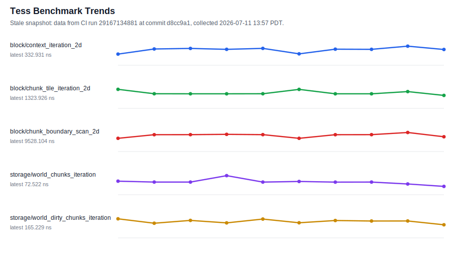

# tess

[](https://github.com/kindjie/tess/actions/workflows/ci.yml)

`tess` is a performance-first C++ tile and path simulation substrate.

The current development release is `v0.3.0`. All `0.x` releases are
pre-stable: public APIs and data layouts may change without compatibility
shims while the design is still being validated.

The project has an implemented synchronous MVP foundation. Documentation lives
in `docs/`. The original TDDs are archived under `docs/tdd/`; maintained
architecture docs track the current implementation as code lands.

## Requirements

- A C++20 compiler (Clang, GCC, AppleClang, or MSVC)
- CMake 3.28 or newer
- Git and network access for developer presets that fetch test dependencies

The installed library is header-only. GoogleTest, Google Benchmark, and EnTT
are development or optional integration dependencies; ordinary consumers do
not link them through `tess::tess`.

## Build and install

```sh
cmake --preset dev
cmake --build --preset dev
ctest --preset dev
```

Install to a chosen prefix and consume the generated CMake package:

```sh
cmake --preset release
cmake --build --preset release
cmake --install build/release --prefix "$HOME/.local"
```

```cmake
find_package(tess 0.3 CONFIG REQUIRED)
target_link_libraries(my_target PRIVATE tess::tess)
```

For source-tree integration, add this repository with `add_subdirectory` and
link the same `tess::tess` target. Set `TESS_BUILD_TESTING`,
`TESS_BUILD_EXAMPLES`, and `TESS_BUILD_BENCHMARKS` to `OFF` in a parent build;
they are project-development facilities rather than consumer requirements.

Benchmarks are opt-in and use Google Benchmark:

```sh
cmake --preset bench
cmake --build --preset bench
./build/bench/bench/tess_bench
```

The public CMake target is `tess::tess`. `tess/tess.h` is the
dependency-free umbrella for the core library. The EnTT adapter and Dear ImGui
panels are opt-in headers that consumers include explicitly after their
corresponding third-party header; see `docs/architecture/ecs.md` and
`docs/architecture/diagnostics.md`.

Prefer the narrowest public header that owns the API in compile-sensitive
code. To compare syntax-only header costs on the local compiler, run:

```sh
python3 tools/header_compile_cost.py \
  tess/tess.h tess/core/shape.h tess/path/path.h
```

The `dev` preset also builds the examples (each a self-checking binary,
smoke-run in CI):

- `examples/tess_mvp_path` — a small end-to-end queued-edit plus A*
  pathfinding prototype.
- `examples/tess_path_agents` — a multi-agent path-agent tick loop with
  goal assignment, dirty-driven replanning, and blocked-path handling.
- `examples/tess_colony_2d` — the flagship composition: queued
  construction edits through the auto-exec schedule task, an OnDirty
  topology rebuild, movement-class agents routing around the new wall,
  and a DeltaFrame render consumer, all in one `tess::Schedule` loop.
- `examples/tess_ant_farm_vertical` — a degenerate-axis vertical world
  (x-z cross-section) sharing one distance-field product across ants via
  the byte-budgeted `FieldProductCache`.
- `examples/tess_stairs_3d` — the `StairTransitions` provider connecting
  two z-levels, with reachability, the path-runtime precheck, and an
  incremental update after demolishing the stair.
- `examples/tess_custom_ecs_min` — the ECS adapter concepts implemented
  by a deliberately non-EnTT-shaped micro ECS.
- `examples/tess_entt_pawns` — the EnTT adapter driving registry-owned
  pawns (built when `TESS_ENABLE_ENTT` is on).
- `examples/tess_render_delta_consumer` — a standalone DeltaFrame
  consumer rebuilding a shadow grid from published frames.

## Testing on a Steam Deck

Build on macOS (for x86_64, in Valve's Steam Runtime container) and run the
tests or benchmarks on real Steam Deck hardware via `tools/steamdeck/deck` — see
[`tools/steamdeck/README.md`](tools/steamdeck/README.md). Quickstart:

```sh
tools/steamdeck/deck setup && tools/steamdeck/deck deck-setup   # once
tools/steamdeck/deck bench --pin                                # run on the Deck
```

## Quality Gates

Project warnings are errors in the `dev-werror`, `dev-asan`, `dev-tsan`,
`release`, `bench`, `bench-profile`, and `windows-msvc` presets. CI also uses
`dev-werror` for the required GCC portability build.

CI runs primarily on `ubuntu-24.04` with Clang and covers:

- Dev build and unit tests: `cmake --build --preset dev`,
  `ctest --preset dev`
- Installed header file-set drift check: `tess_installed_headers_file_set`
- Installed package smoke test: `tools/install_smoke.sh`
- Hook backstop checks: `tools/git_hooks.py ci` repository hygiene plus
  pytest for the repo tools (`tests/test_git_hooks.py`,
  `tests/test_benchmark_tools.py`, `tests/test_check_public_surface.py`)
  and the bidirectional public-surface manifest gate
  (`tools/check_public_surface.py` against
  `docs/architecture/surface.json`; required since 2026-07-07)
- Installed-header namespace-scope Doxygen gate: `tools/check_public_docs.py`
- Warnings-as-errors build and tests: preset `dev-werror`
- ASan/UBSan build and tests (UBSan findings are fatal): preset `dev-asan`
- TSan build and tests (`TSAN_OPTIONS=halt_on_error=1`): preset `dev-tsan`
- Release build and tests: preset `release`
- macOS build, tests, and install smoke on `macos-15`: presets `dev` and
  `dev-asan` (no benchmark gates there; thresholds are Linux-calibrated)
- Windows MSVC build, tests, and install smoke on `windows-2025`:
  preset `windows-msvc` (required gate since 2026-07-07)
- Strict clang-tidy gate: `cmake --build --preset dev-clang-tidy`
- cppcheck gate: `cmake --build --preset dev-cppcheck`
- Advisory (non-gating) clang-tidy profile: preset `dev-clang-tidy-advisory`
- Required GCC compile-only portability check: preset `dev-werror` built with
  GCC
- Benchmark build and smoke tests: presets `bench`
- Benchmark threshold gates, one per suite (CPU time except parallel wall
  time):
  `cmake --build --preset bench --target tess_bench_<suite>_thresholds`
  for `key`, `storage`, `block`, `queued`, `path`, `topology`, `scheduler`,
  `residency`, `parallel`, `ecs`, `render_delta`, `fields`, and `diagnostics`
- Non-gating CI benchmark baseline collection:
  `cmake --build --preset bench --target tess_bench_ci_baselines`

Benchmark thresholds enforce calibrated per-benchmark CPU-time ceilings
(`bench/thresholds/*.json`) and fail CI when exceeded or when an expected
benchmark is missing. Wall-clock ceilings stay unset because shared-runner
wall time is too noisy to gate. Recalibrate from CI baseline artifacts after
intentional performance changes; summarize downloaded artifacts with:

```sh
tools/benchmark_baseline_summary.py path/to/*.json
```

New contributors: install the local git hooks with
`python3 tools/git_hooks.py install` (see
[`docs/git-hooks.md`](docs/git-hooks.md)) and read
[`docs/style.md`](docs/style.md) for formatting and layout conventions.

## Benchmark Trends



This snapshot is intentionally labeled with its source CI run, commit, and
Pacific-time collection timestamp. It may be stale by a few commits. See
[`docs/performance.md`](docs/performance.md) for when and how to regenerate it,
and use CI benchmark artifacts as the source of truth for threshold
calibration.

## Name

`tess` is named after tesserae and tessellation: small spatial pieces composed
into large, structured worlds for fast simulation, topology, and pathfinding.

## License

Licensed under the [MIT License](LICENSE).
