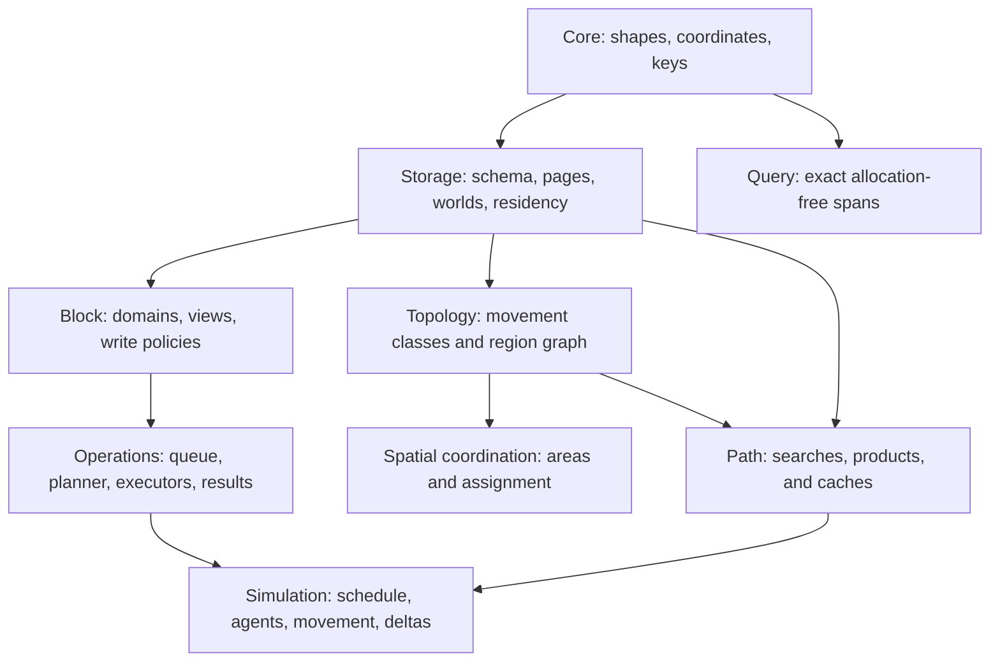
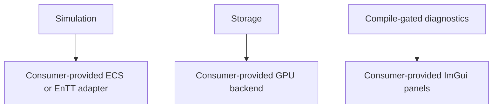
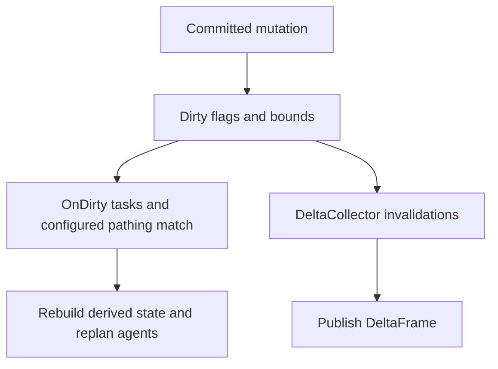
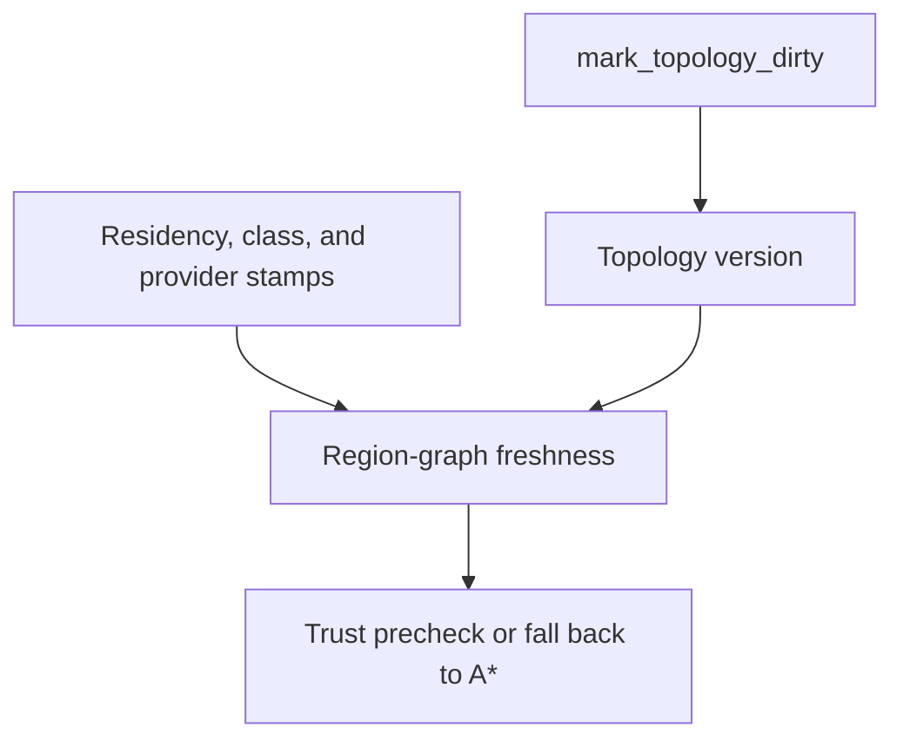
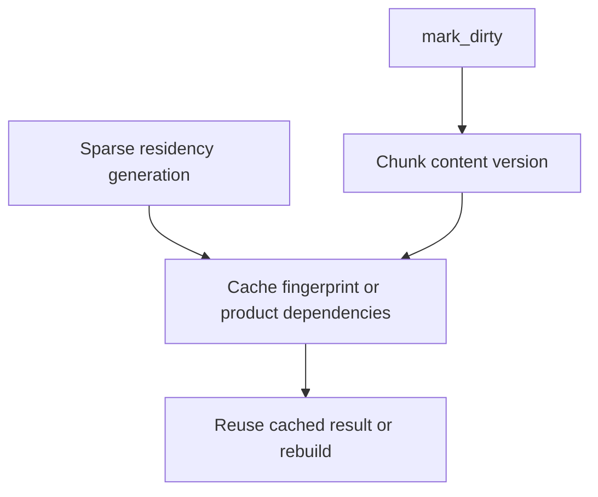

# Architecture

This directory contains maintained architecture documentation for the current
implementation.

The current surface includes sparse residency,
queued operations with result channels, the schedule with cadences and the
selectable parallel phase executor, movement classes with per-class topology
and transition providers, A* with the region-graph precheck, distance-field
products and caches, the ECS adapter (EnTT-gated), the versioned DeltaFrame
render bridge, compile-gated diagnostics, and the GPU backend interface
(interface only in the current release).

## Layer Map

Arrows point from foundations to the higher-level facilities they enable.
Optional adapters remain outside the dependency-free core surface.

Optional integration headers sit on explicit boundaries and are never pulled
into the dependency-free umbrella by accident.

## Change Propagation

Mutations are useful downstream only when their metadata is declared
accurately. Different metadata guards different derived products.

### Dirty-Driven Work

### Region-Graph Freshness

### Path-Cache Validity

Maintained notes for implemented areas:

- [Shape, coordinate, and key foundation](shape.md)
- [Storage foundation](storage.md)
- [Block foundation](block.md)
- [Span queries](query.md)
- [Experimental maintenance scheduling](maintenance.md)
- [Queued operations foundation](queued-operations.md)
- [Topology foundation](topology.md)
- [Path foundation](path.md)
- [Spatial coordination](spatial-coordination.md)
- [Simulation integration MVP](simulation.md)
- [Diagnostics foundation](diagnostics.md)
- [ECS integration](ecs.md)
- [GPU backend interface](gpu.md)

The umbrella header `tess/tess.h` exports the dependency-free core surface plus
the configured `TESS_VERSION_MAJOR`, `TESS_VERSION_MINOR`, and
`TESS_VERSION_PATCH` macros and their typed `tess::version` /
`tess::library_version` representation. Optional integrations
that require consumer-provided EnTT or Dear ImGui declarations are
deliberately not included; consumers include those adapter headers explicitly.

## Historical design intent (TDD archive)

The TDD archive preserves the original design intent behind each area.
These documents are non-authoritative: the maintained notes above and
the code are the source of truth for current behavior.

- [Project design][project-design]
- [Shape, coordinate, and key system][shape-tdd]
- [Chunk storage][storage-tdd]
- [Queued operations and planner][queued-tdd]
- [Simulation scheduler][simulation-tdd]
- [Topology and region graph][topology-tdd]
- [Pathfinding core][path-tdd]
- [Flow and distance fields][fields-tdd]
- [ECS integration][ecs-tdd]
- [Render delta bridge][render-tdd]
- [Block kernel pipeline][block-tdd]
- [GPU backend interface][gpu-tdd]
- [Diagnostics and tooling][diagnostics-tdd]
- [Modern C++ safety][safety-tdd]

[project-design]: https://github.com/kindjie/tess/blob/main/docs/tdd/project-design.md
[shape-tdd]: https://github.com/kindjie/tess/blob/main/docs/tdd/core-shape-coordinate-key-system.md
[storage-tdd]: https://github.com/kindjie/tess/blob/main/docs/tdd/core-chunk-storage.md
[queued-tdd]: https://github.com/kindjie/tess/blob/main/docs/tdd/queued-operations-and-planner.md
[simulation-tdd]: https://github.com/kindjie/tess/blob/main/docs/tdd/simulation-scheduler.md
[topology-tdd]: https://github.com/kindjie/tess/blob/main/docs/tdd/topology-and-region-graph.md
[path-tdd]: https://github.com/kindjie/tess/blob/main/docs/tdd/pathfinding-core.md
[fields-tdd]: https://github.com/kindjie/tess/blob/main/docs/tdd/flow-distance-fields.md
[ecs-tdd]: https://github.com/kindjie/tess/blob/main/docs/tdd/ecs-integration.md
[render-tdd]: https://github.com/kindjie/tess/blob/main/docs/tdd/render-delta-presentation-bridge.md
[block-tdd]: https://github.com/kindjie/tess/blob/main/docs/tdd/block-kernel-pipeline.md
[gpu-tdd]: https://github.com/kindjie/tess/blob/main/docs/tdd/gpu-backend-interface.md
[diagnostics-tdd]: https://github.com/kindjie/tess/blob/main/docs/tdd/diagnostics-and-tooling.md
[safety-tdd]: https://github.com/kindjie/tess/blob/main/docs/tdd/modern-cpp-compile-time-safety.md
