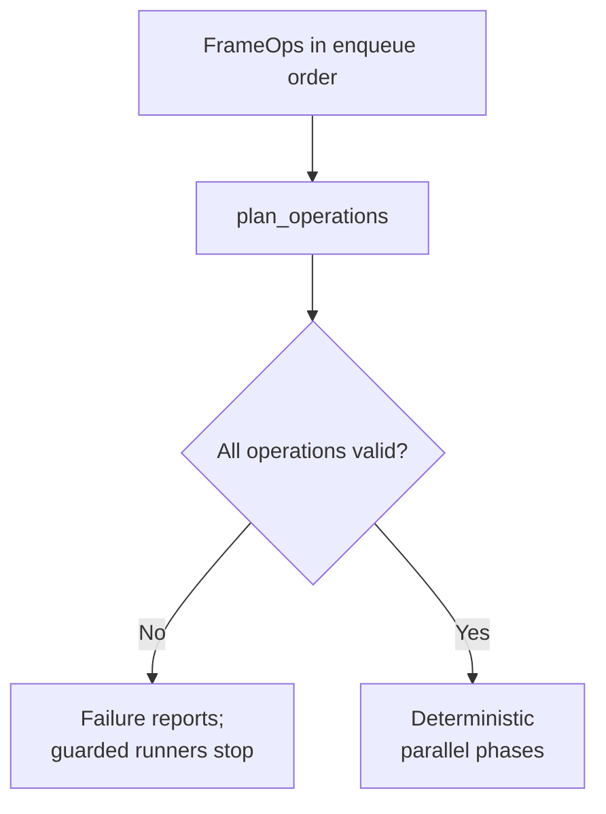
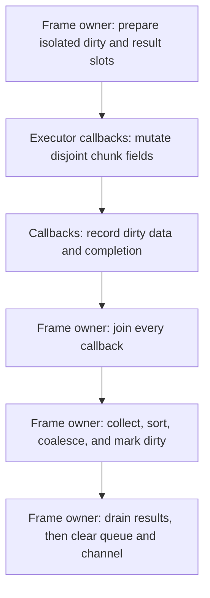

# Queued Operations Foundation

The current queued-operations layer is the first M4 scaffold over the existing
storage and block APIs. It lives in `include/tess/ops/queued.h` and is exported
by `tess/tess.h`.

The guarded scheduler and `AutoExecTask` execution boundary keeps planning and
metadata reduction on the frame owner. Concurrent callbacks receive only
planner-proven disjoint mutable chunk domains and isolated result/dirty slots.



### Execution Ownership



## Public Surface

- `FrameOps` owns the operations submitted for one planning frame.
  `FrameOps::clear()` resets the frame for reuse: it drops all queued
  operations while keeping the enqueue vector's capacity, so warm frame
  loops re-enqueue without allocating. Clearing invalidates previously
  returned handles, and handle/id assignment restarts at zero on the next
  enqueue.
- `OpHandle` is a stable handle assigned when an operation is enqueued.
- `OpId` is assigned in enqueue order. The current handle value and id value
  both start at zero and advance together, but they remain separate public
  types. Default-constructed `OpHandle` and `OpId` values compare equal to
  zero.
- `Priority` records broad planning priority: `Immediate`,
  `GameplayCritical`, `VisibleSoon`, `Background`, and `Maintenance`.
- `BudgetPolicy` records basic budget intent: `MustRun`, `CanDefer`,
  `CanSkipIfSuperseded`, and `BudgetedIncremental`.
- `OperationStatus` records per-operation planner outcome. The current
  statuses are `Planned`, `InvalidIdentity`, `InvalidWritePolicy`,
  `InvalidDomain`, `InvalidFieldAccess`, and `HazardConflict`.
- `OperationFailure` records the stable reason for an invalid operation. The
  current values are `None` (carried by planned operations),
  `NonDenseHandle`, `NonDenseId`, `InvalidWritePolicyValue`,
  `ExplicitChunkOutOfRange`, `ReadOnlyWriteMask`, and `FieldHazardConflict`.
- `DomainDesc` owns a minimal operation domain descriptor:
  `explicit_chunks(keys)`, `dirty_chunks(mask)`, `active_chunks(mask)`, or
  `resident_chunks()`.
- `FieldAccessDesc` records untyped field access masks for an operation:
  `read_mask`, `write_mask`, and `dirty_mask`. These are planner metadata only
  in this slice; they do not mutate world dirty flags and are not field-tag
  reflection.
- `QueuedOperation` stores the submitted `OperationKind` (currently only
  `UpdateField`), handle, id, domain, field access, `WritePolicy`,
  priority, budget policy, and `std::source_location`.
- `OperationAccess` records the diagnostic access metadata known to the
  planner: write policy, `DomainKind` (`ExplicitChunks`, `DirtyChunks`,
  `ActiveChunks`, or `ResidentChunks`), and domain mask. It is diagnostic
  metadata only in this slice, not a hazard solver.
- `ExecutionPlan` stores `PlannedOperation` entries in enqueue order. Each
  planned operation contains the diagnostic access metadata and expanded
  chunk-key vector behind an immutable `chunks()` view. It is not an
  aggregate: the planner or checked `PlannedOperation::create` factory stamps
  the world shape and chunk bound. `PlannedOperationCreateStatus` and
  `PlannedOperationCreateResult` report `Created` or the first `InvalidChunk`.
- `ExecutionPhasePlan` stores deterministic contiguous `ExecutionPhase`
  capabilities for planned operations that are eligible to run in the same
  future parallel phase, plus an `ExecutionPhaseStatus` (`Ready` or
  `UnsupportedWritePolicy`). `plan_parallel_execution_phases(plan)` accepts
  only `ReadOnly` and `UniquePerChunk` planned operations for now. If a
  mutable chunk operation touches a chunk already present in the current
  phase, the planner starts a later phase so chunk field data and
  dirty/version metadata are not mutated concurrently. `UniquePerTile` is
  deliberately rejected until tile subdomains and tile-level ownership
  validation exist. Each non-owning capability is bound to the exact
  `ExecutionPlan` generation that issued it; that plan must outlive the phase
  plan and any copied phases. Replanning or replacing the owning
  `ExecutionReport` increments the generation and expires every older phase.
- `ExecutionReport` stores one `OperationReport` per queued operation and
  the plan entries for operations that passed validation.
- `planned_chunk_domain(planned)` adapts a successful planned operation into a
  non-owning `ChunkDomain` span over the planned operation's owned chunk
  vector.
- `planned_policy_matches<Policy>(planned)` checks whether the planned write
  policy exactly matches the requested block policy.
- `validate_planned_operation<Policy>(world, planned)` combines the write
  policy check with the operation's O(1) shape and chunk-bound stamp. Execution
  reports `InvalidShape`, `InvalidChunk`, or `PolicyMismatch` before world
  access when a plan is used with an incompatible world.
- `try_planned_block_ctx<Policy>(world, planned)` returns a policy-typed
  `BlockCtx` over the planned chunk domain when the policies match, or
  `std::nullopt` on mismatch.
- `PlannedDirtyAccumulator` records `PlannedDirtyRecord` entries
  (`{chunk, dirty_mask, bounds}`) produced during planned execution without
  mutating chunk metadata. `record(world, ...)` returns a
  `PlannedDirtyRecordStatus` (`Recorded`, `IgnoredEmptyMask`, `InvalidShape`,
  or `InvalidChunk`) and never mixes records from incompatible worlds.
  `merge_planned_dirty(world, accumulator)` sorts records by chunk key,
  coalesces repeated chunk records into one dirty mask and unioned bounds,
  applies `world.mark_dirty` once per touched chunk, clears the accumulator,
  and returns `PlannedDirtyMergeResult` with a `PlannedDirtyMergeStatus` and
  merged chunk count. `collect_planned_dirty` likewise returns
  `PlannedDirtyCollectResult` / `PlannedDirtyCollectStatus`; incompatible
  partitions are rejected without mutating the destination or partitions.

The first submitted operation category is `FrameOps::update_field(...)`. It
records field/block-style work intent only; it does not accept callbacks or
invoke kernels.

## Planning Behavior

`plan_operations(world, ops)` validates and expands queued operations over the
current always-resident world metadata.

The public span overload requires enqueue-order identities: operation `i` must
carry `OpHandle{i}` and `OpId{i}`. A mismatch is reported as
`InvalidIdentity` under the safe canonical index, so later result-channel
publication remains dense and cannot resize from an untrusted handle.

Validation currently covers:

- invalid `WritePolicy` enum values
- non-dense or duplicate operation handles and ids
- explicit chunk keys outside the world
- `ReadOnly` operations that declare nonzero field write masks
- deterministic field hazards against earlier successfully planned operations

Expansion currently covers:

- explicit chunks copied into deterministic ascending `ChunkKey` order with
  duplicate keys removed, so one planned operation never visits a chunk
  twice (repeated keys under `UniquePerChunk` would otherwise break the
  per-chunk ownership rule that parallel phase planning relies on)
- dirty chunks discovered through `world.dirty_chunks(mask)`
- active chunks discovered through `world.active_chunks(mask)`
- all chunks in an always-resident world for `resident_chunks()`

Planning preserves enqueue order for reports and successful plan entries.
Operations with invalid write policies or invalid domains still receive report
entries, but they do not produce plan entries.

Report helpers expose deterministic inspection without changing ownership:

- `ok()` and `failed()` summarize whether any operation failed validation.
- `planned_count()` returns the number of successful plan entries.
- `failed_count()` returns the number of failed report entries.
- `find(handle)` performs a linear lookup in report order and returns the
  matching report entry or `nullptr`.

Invalid operation reports include `OperationFailure`. Invalid explicit chunk
domains also include the first out-of-range `ChunkKey` as diagnostic detail.
Invalid read-only write-mask reports include the submitted `FieldAccessDesc` so
callers can diagnose the bad declaration.
Hazard reports include the earlier conflicting operation handle/id and the
overlapping field mask. The planner does not reorder operations or insert
barriers; it rejects the later conflicting operation and keeps the earlier
planned operation.

`plan_parallel_execution_phases(plan)` is a separate conservative view over a
successful plan. It does not execute work and does not relax existing hazard
validation. It groups already-planned operations into deterministic phase
ranges that preserve operation order. Read-only operations can share a phase
with other read-only operations. A `UniquePerChunk` operation can share a
phase only when its chunk domain is disjoint from every other operation
already in that phase, read-only work included: a mutable operation
conflicts with any overlapping operation even when field masks are
disjoint, because chunk dirty bounds and version metadata are shared at
chunk scope.

The plan-to-block adapter is intentionally non-owning. The planned operation
must outlive any `ChunkDomain` or `BlockCtx` produced from it, because those
objects point at `planned.chunks()`. Adapter construction and iteration over a
prebuilt plan do not allocate.

## Minimal Execution Bridge

Planned operations can now be executed explicitly through the serial block API:

<!-- tess-snippet: execute-planned-operation source=tests/tess_queued_test.cc -->
```cpp
const auto result =
    tess::execute_planned_operation<tess::WritePolicy::UniquePerChunk>(
        world, report.plan().operations()[0], [](auto view) {
          auto terrain = view.template field_span<TerrainTag>();
          terrain[0] = static_cast<std::uint16_t>(view.key().value + 10);
        });
```
<!-- /tess-snippet -->

`execute_planned_operation<Policy>` rejects policy mismatches before invoking
the callback. On success, it creates a policy-typed `BlockCtx`, visits the
planned chunks in deterministic key order, invokes the callback once per chunk
view, and marks each visited chunk dirty when the planned operation declares a
nonzero `dirty_mask`. Execution helpers return a `PlannedExecutionResult`
carrying a `PlannedExecutionStatus` (`Executed`, `PolicyMismatch`,
`InvalidShape`, `InvalidChunk`, or `InvalidPhase`) plus the successful
plan-order chunk prefix. Concurrent work after the first failing operation may
complete, but those chunks are intentionally excluded from the count.

`execute_plan<Policy>` applies the same callback to each planned operation in
plan order and stops at the first policy mismatch. This is still a synchronous
caller-driven bridge, not a scheduler.

`execute_planned_operation_deferred_dirty<Policy>` and
`execute_plan_deferred_dirty<Policy>` run the same callbacks but record
declared dirty chunks into a caller-owned `PlannedDirtyAccumulator` instead of
mutating world metadata inside the callback loop. Callers can then merge dirty
metadata after a serial operation, after a whole phase, or after future worker
jobs complete. The deferred path is the intended handoff point for parallel
execution because workers can keep dirty records local and the main thread can
merge metadata deterministically.

`PlannedDirtyPartitions` owns multiple dirty accumulators and
`PlannedPhaseExecutionScratch` owns per-operation dirty partitions,
per-operation execution results, and a merged-dirty scratch accumulator. These
types let a phase backend route each planned operation into a distinct dirty
buffer instead of sharing one `PlannedDirtyAccumulator` across callbacks. The
phase partitions contain only record vectors; one shape/chunk stamp on the
enclosing scratch object protects every partition without widening the hot
per-operation record-vector stride.
`collect_planned_dirty(...)` appends partition records into a caller-owned
accumulator and clears the partitions. `merge_planned_dirty(world, partitions,
scratch)` and `merge_planned_dirty(world, phase_scratch)` collect those records,
sort/coalesce by chunk key through the normal dirty merge, update world
metadata, and clear the intermediate buffers.

`execute_phase_deferred_dirty<Policy>` executes one planner-issued
`ExecutionPhase` from its bound `ExecutionPlan` through the same deferred-dirty
path. Phase helpers reject a capability from another plan or an earlier
generation with one pointer comparison, generation comparison, and bounds
check before invoking callbacks or changing dirty scratch or result channels.
The capability also carries one world stamp and a compact mask of every policy
in the phase, so wrong-world and mixed-policy phases fail in O(1), before
dispatch. They visit only operations in that range and return `InvalidPhase`,
`InvalidShape`, `InvalidChunk`, or `PolicyMismatch` without side effects when
the phase cannot be executed. The default implementation is serial; worker
backends must preserve the same validation and dirty-merge contract.

The executor contract lives in its own public header,
`tess/ops/phase_executor.h`, so backends can be written and tested without
pulling in the planner. `ExecutorPhaseRange` is the backend-facing
operation-index range shape copied from an `ExecutionPhase` by
`executor_phase_range(phase)` (the plan-side bridge stays in
`tess/ops/queued.h`). It is raw range vocabulary, not proof that a range is a
legal parallel phase. `execute_operation_index_range(executor, range, fn)`
retains that low-level executor test and integration seam.
`SerialPhaseExecutor` is the default executor used by
`execute_phase_deferred_dirty<Policy>`. Callers that need to test a backend
integration point can use `execute_phase_deferred_dirty_with<Policy>` and
pass an executor that provides:

<!-- tess-snippet: phase-executor source=tests/tess_queued_test.cc -->
```cpp
template <typename Fn>
auto for_each_operation(std::size_t first, std::size_t count, Fn&& fn)
    -> tess::PlannedExecutionResult {
  auto&& callback = fn;
  const auto end = first + count;
  for (std::size_t i = first; i < end; ++i) {
    indexes.push_back(i);
    auto result = callback(i);
    if (result.status != tess::PlannedExecutionStatus::Executed) {
      return result;
    }
  }
  return tess::PlannedExecutionResult{};
}
```
<!-- /tess-snippet -->

The executor receives planned operation indexes and must return the first
non-`Executed` result from the callback, or `Executed` if the whole range
completed. The `tess::PhaseExecutor` concept states this contract
structurally: a const executor must accept
`for_each_operation(first, count, fn)` for a callback returning
`PlannedExecutionResult` and return `PlannedExecutionResult`. This is the
`PhaseExecutor` concept; `SerialExecutor` refines it with the
`serial_execution_tag` promise. Implementations
must complete or join every callback (making all callback writes visible)
before returning. The header also documents the thread contract: world
fields and `ChunkMeta` stay non-atomic, concurrent callbacks are safe only
because phase planning proves disjoint mutable chunk ownership, and worker
callbacks write dirty records into caller-owned partitions that the caller
reduces in plan order after the executor returns. This helper is a serial
bridge over one caller-owned `PlannedDirtyAccumulator` and a shared chunk
counter, and the serial
contract is now enforced structurally instead of by convention:
`execute_phase_deferred_dirty_with<Policy>` requires the
`tess::SerialExecutor` concept, which is satisfied only by executor types
that declare a nested `serial_execution_tag` type alias. Declaring the tag
is the executor author's promise that `for_each_operation` invokes the
per-operation callback strictly one at a time. `SerialPhaseExecutor`
declares the tag; `ScopedThreadPhaseExecutor` deliberately does not, so
passing it (or any untagged concurrent executor) to the shared-accumulator
helper is a compile error rather than a data race. Concurrent executors
must use `execute_phase_partitioned_dirty_with<Policy>`, which accepts both
serial and concurrent executors. Any executor used with these helpers must
complete, join, or otherwise make all invoked callbacks visible before
returning its `PlannedExecutionResult`. Threaded executors cancel work that has
not started after a callback exception, join callbacks already in flight, then
rethrow on the dispatching thread. If callbacks throw concurrently, which
exception is propagated is unspecified. They do not roll back partial writes.

`ScopedThreadPhaseExecutor` is a documented prototype for this contract, not
the production backend. It owns no persistent pool: each call splits one
operation-index range across a bounded number of `std::thread` workers
(worker counts clamp to at least one, including when
`hardware_concurrency()` reports zero), joins all workers before returning,
and reports the first non-`Executed` callback result in operation order. It
invokes callbacks concurrently, so it pairs only with the partitioned
variant below. It exists to prove the phase handoff and visibility rules
as a lightweight comparison backend alongside the long-lived pool. When
diagnostics are enabled, it
records dispatch counts and worker counts before launching threads; the scoped
queued-phase diagnostics are intentionally owned by the caller thread and are
not mutated from worker callbacks.

`WorkerPoolPhaseExecutor` is the persistent-pool prototype the concurrent
tile-world addendum calls for: workers are created once at construction and
reused across phases, so phase dispatch never creates threads. Each
`for_each_operation` call publishes one type-erased job under the pool
mutex, wakes the workers, and blocks until every claimed operation has
finished and every adopted worker has left the claim loop, so all callback
writes are visible before it returns; it then reports the first
non-`Executed` result in operation order. `reserve_operations(count)`
pre-sizes the per-operation result buffer so warm phases allocate nothing.
Like the scoped-thread prototype it invokes callbacks concurrently, does not
declare `serial_execution_tag`, and pairs only with the partitioned dirty
variant. It is non-copyable and non-movable, stops its workers via RAII, and
propagates callback exceptions only after every adopted worker has left the
claim loop. As of the M5 scheduler stage it is the PRODUCTION
parallel backend: the auto-exec schedule task routes phases to an attached
pool by operation count, with serial == pool results pinned byte-identical
(policy pre-validation makes runtime aborts unreachable) and the schedule +
auto-exec test binaries running under the TSan preset. The work_contract
library remains an unadopted experiment.

`execute_phase_partitioned_dirty_with<Policy>` uses the same executor contract,
but stores callback dirty records and execution results in
`PlannedPhaseExecutionScratch` by operation offset. This avoids shared result
and dirty-buffer mutation during dispatch; after the executor returns, the
helper reduces operation results in plan order and callers merge dirty metadata
deterministically with `merge_planned_dirty(world, scratch)`. The scratch can be
pre-reserved and prepared for a known phase operation count so warm partitioned
execution and dirty merge do not allocate. Queued-operation tests exercise this
contract with a test-only `std::thread` executor over disjoint chunk mutations
and overlapping read-only chunk access, plus deterministic replay stress that
compares serial phase execution against `ScopedThreadPhaseExecutor` across
many shuffled legal phase plans. The ownership rule is deliberately small:
`ReadOnly` phase operations may overlap chunk domains with each other and
receive const views, while `UniquePerChunk` phase operations may run
concurrently only after phase planning proves their chunk domains are
disjoint from every other operation in the phase, including read-only
overlap. User callbacks must
still synchronize any mutable state they capture themselves. Production worker
pool exceptions suppress only unclaimed callbacks; transactional rollback and
result-channel completion remain outside this layer.
Diagnostics also count validated phase calls, partition counts, invalid phase
capabilities, phase failures, collected dirty records, and merged dirty chunks.

Non-exceptional operation-status failures do not cancel partitioned execution.
If one operation reports failure while a parallel executor has already started
other operations, those operations complete and the executor continues to
visit the phase. `execute_phase_partitioned_dirty_with<Policy>` reports the
first non-`Executed` operation result in plan order and includes only earlier
successful chunks in the returned `chunk_count`; completed dirty partitions
remain in caller-owned scratch. The caller decides whether to merge or discard
those dirty records after a failure. Callback exceptions instead cancel work
that has not started, as described above, and bypass normal result reduction by
rethrowing after the join. Dirty records are written before invoking each
callback, so a callback that mutates and then throws cannot leave its chunk
metadata clean. Auto-exec catches only to apply a no-allocation, coalescing
exception merge after the executor join, then rethrows the original exception;
normal phase merge keeps the reusable sort/coalesce path.

Inspecting existing queued operations, reports, and planned operations returns
non-owning spans and does not allocate. Enqueueing and domain/report expansion
may allocate because `FrameOps`, explicit domains, reports, and planned chunk
lists own their storage.

## Result Channels

`include/tess/ops/result_channel.h` closes M4's result gap with a
deliberately drain-only, synchronous design:

- `OpCompletion` is the per-operation completion record, carrying both
  failure domains -- plan-time verdicts (`OperationStatus` /
  `OperationFailure`, from the `OperationReport`) and run-time verdicts
  (`PlannedExecutionStatus`) -- plus the executed chunk count and the
  enqueue-site `source_location`. A `completed` flag distinguishes a stamped
  record from a default-constructed one, so `ok()` can never read true for a
  slot that was never completed.
- `OpResultState` is the current slot vocabulary: `Unbound` (no slot), `Pending`
  (prepared, not completed -- including the tail of a plan that aborted
  early), `Ready` (completed, value readable), `Failed` (completed with
  reasons; no value).
- `ResultChannel<T>` is caller-owned, fixed-capacity scratch keyed by
  `OpHandle`. Slots are dense (slot index == handle value; `FrameOps` hands
  out handles 0..N-1 per frame), so lookup is O(1) with no map. Publication
  is executor-agnostic without atomics: each op's executing thread writes
  only its own slot, and every read happens on the frame owner's thread
  after the synchronous execute call returns, so the phase executor's join
  barrier supplies visibility. `drain_results(visitor)` visits every
  completed, not-yet-drained slot in handle (== enqueue) order as
  `visit(OpHandle, const OpCompletion&, const T* value)` with a null value
  for `Failed` slots -- failures deliver reasons, never values -- and marks
  them drained only after the visitor returns successfully (drain-once). If a
  visitor throws, that slot remains retryable; earlier successful visits stay
  consumed. A visitor may reserve more channel capacity before throwing
  without invalidating retry state. A reentrant `clear()` ends the current
  drain, and exception recovery never touches the retired generation.
  References passed to the visitor expire if it changes channel storage or
  lifecycle. `state()`/`completion()` lookups stay readable until `clear()`.
  `clear()` must pair with `FrameOps::clear()`: handle
  assignment restarts at zero there, and a channel kept across it would
  alias new-frame handles onto stale slots (the `generation()` counter
  exists so tests and long-lived callers can assert the discipline).
- `record_plan_completions(report, channel)` copies every plan-time
  rejection out of an `ExecutionReport` into `Failed` slots before
  execution, so validation failures and executed results flow through one
  drain.
- `execute_phase_partitioned_dirty_with_results<Policy>(executor, world,
  plan, phase, scratch, channel, fn)` is the result-bearing variant of the
  partitioned phase helper: the callback receives each chunk view plus a
  mutable reference to the operation's channel value (`fn(view, T&)`),
  accumulated op-exclusively on the executing thread. Every operation in
  the phase is prepared upfront, so a serial early-stop leaves a `Pending`
  tail rather than gaps, and each op's completion is stamped by its
  executing thread — a post-barrier sweep of the scratch results would
  misread never-run operations as executed, because
  `PlannedExecutionResult` default-constructs to `Executed`. The phase
  range is validated before the channel is touched; aggregate return and
  dirty partitioning are identical to the resultless helper. Delivery
  content and drain order are identical under serial and threaded
  executors for successful plans; on failure the serial executor's
  early-stop tail reads `Pending` while threaded executors, which drain
  the whole range by contract, complete it.
- `execute_plan_deferred_dirty_with_results<Policy>(world, plan, dirty,
  channel, fn)` is the serial whole-plan variant with the same
  partial-execution contract as `execute_plan_deferred_dirty` (aborts keep
  earlier writes and report their chunks); the aborted tail reads
  `Pending`.

There is intentionally no future/handle type in the current synchronous API:
the pipeline has no asynchronous execution path, so a future could never be
observed pending
across a caller-visible boundary. One returns when budget-deferred execution
gives it a real consumer; this is a recorded TDD divergence alongside the
deferred cancelled/superseded states.

## Deliberate Limits

This slice intentionally does not implement:

- queued kernel storage or callback ownership
- async handles/futures (results are synchronous and drain-only; see Result
  Channels above)
- asynchronous scheduling or work that remains pending across phase calls;
  the persistent pool is synchronous at the caller-visible boundary
- general type-erased queued-kernel ownership; `AutoExecTask` binds one typed
  chunk callback and executes its queue synchronously through the schedule
- thread-local dirty accumulator policy beyond caller-owned per-operation
  phase partitions
- topology, pathfinding, movement, residency transitions, or GPU selection
- work-contract or maintenance-scheduler semantics
- field tag reflection or typed read/write sets beyond explicit mask
  descriptors
- hazard analysis beyond deterministic same-plan field-mask conflicts over
  overlapping chunk domains
- sparse residency or non-resident chunk loading
- rich diagnostics beyond per-op status, failure reason, limited detail, access
  metadata, and captured source location

The Work Contracts addendum remains an experiment proposal. Current queued ops
use the existing dirty/active metadata scans as the baseline and do not add
coalescing scheduler handles or long-lived maintenance tasks.

The persistent worker pool is current production behavior. Additional pool
backends and coalesced maintenance scheduling remain proposed TDD work; see
`docs/tdd/tdd_addendum_concurrent_tile_world.md`.

The phase executor contract is deliberately library-agnostic. External
backends must adapt to the contiguous operation-index range API and preserve
the documented completion, visibility, dirty-partition, and result-reduction
rules before they are wired into queued operations.

## TDD Divergences

The historical queued-operations TDD describes a much larger public planning
and execution system. This M4 slice keeps only the stable foundation needed by
later work:

- `FrameOps::update_field(...)` records intent and optional untyped field
  access masks without a kernel type.
- `DomainDesc` only supports chunk-domain descriptors that can be resolved by
  current always-resident storage.
- `ExecutionPlan` is only an ordered list of expanded chunk keys per operation,
  not a phase graph.
- `ExecutionReport` reports validation status, chunk count, and source
  location plus limited diagnostics, not backend choice, solved/reordered
  hazards, versions, or result channels.
- The plan-to-block adapter only exposes successful planned chunk domains to
  the existing serial block API. It does not execute queued intent by itself.

Those omissions are intentional so future scheduler, topology, pathing, and
diagnostics slices can be added against a deterministic queue and domain
foundation.
