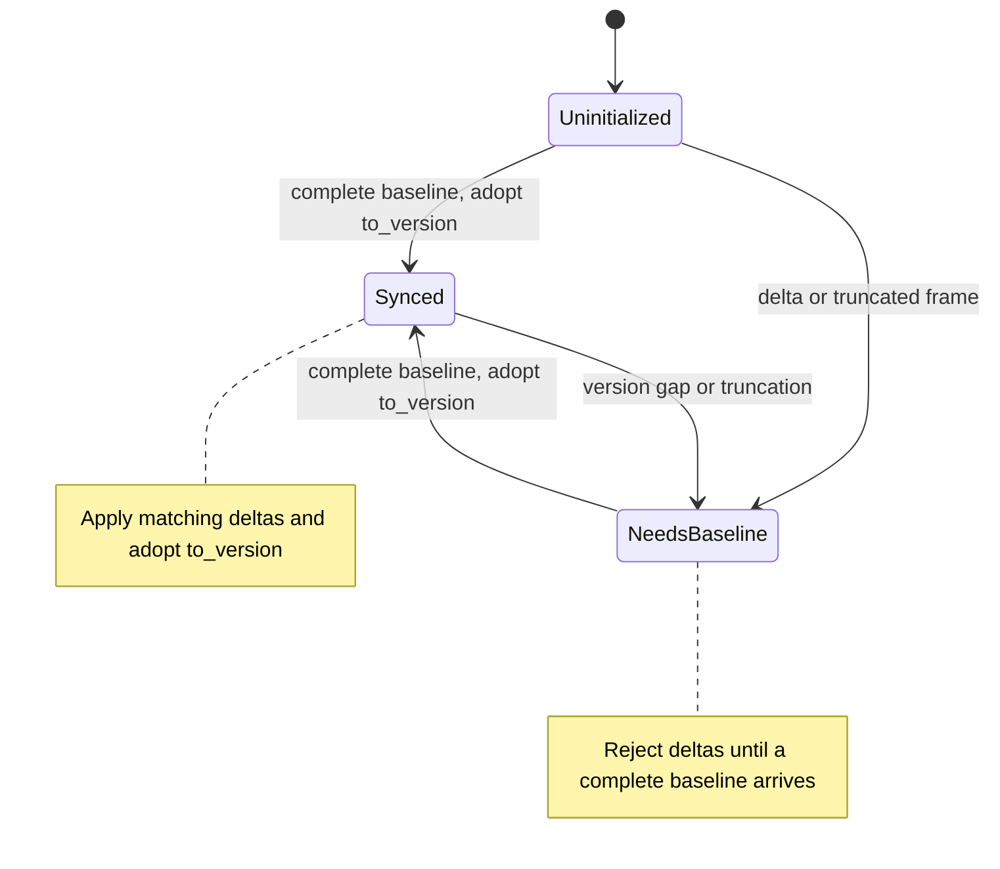
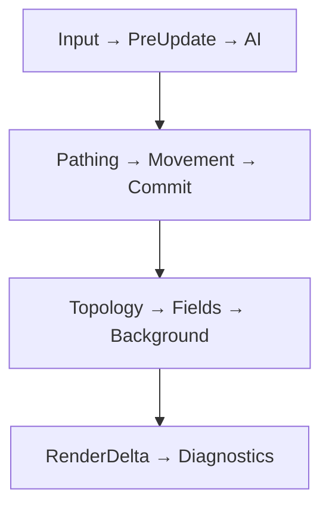
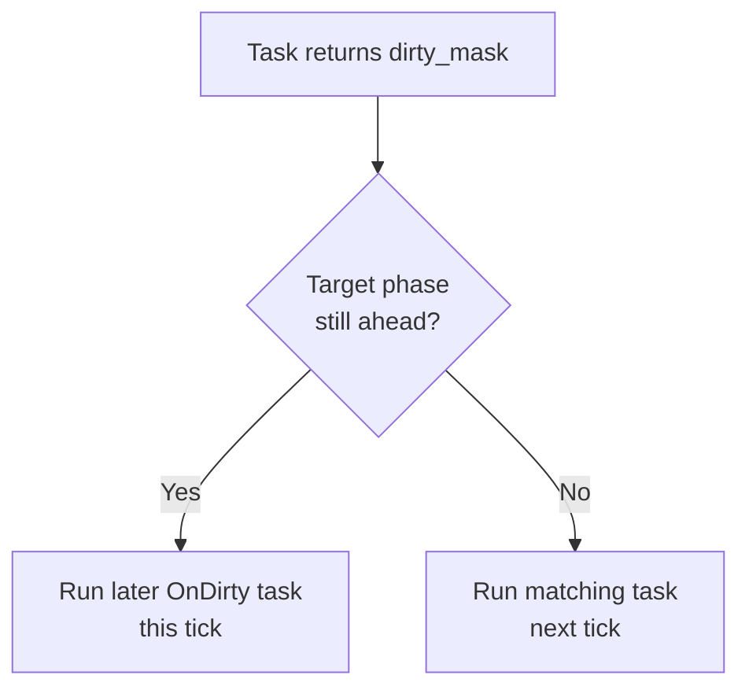

# Simulation Integration MVP

The current simulation integration layer lives under `include/tess/sim/` and
is exported by `tess/tess.h`. It provides the first colony-sim-facing bridge
over storage, queued operations, path requests, movement validation, and render
deltas.

## Public Surface

### Movement

- `MovementIntent` records one adjacent tile move from `from` to `to` plus
  an optional `MovementVersionCheck`.
- `MovementVersionCheck` carries optional expected `from`/`to` chunk
  versions and `from`/`to` topology versions. Unset fields are not checked.
- `MovementStatus` reports `Moved`, invalid endpoints (`InvalidFrom`,
  `InvalidTo`, `NotAdjacent`), blocked endpoints (`BlockedFrom`,
  `BlockedTo`), `Occupied` or `Reserved` destinations, and stale
  `StaleVersion` / `StaleTopology` version guards.
- `MovementResult` returns the status plus the echoed `from`/`to`
  coordinates.
- `is_transient_movement_failure(status)` classifies failures: blocked,
  occupied, reserved, and stale statuses are transient (the world can
  legitimately change under a routed agent; re-path and retry), while
  invalid endpoints and non-adjacent steps indicate a caller bug and are
  terminal.
- `MovementFailureCounts` aggregates failures into `invalid`, `blocked`,
  `occupied`, `reserved`, `stale_version`, and `stale_topology` buckets;
  `record_movement_failure(counts, status)` maps each non-`Moved` status
  into its bucket.
- `movement_versions_match(world, intent)` checks only the optional version
  guards (chunk versions first, then topology versions) and returns `Moved`
  when every set guard matches. It resolves both endpoints unchecked, so
  callers must validate coordinates first.
- `validate_movement_intent<World, ClassOrTag, OccupancyTag,
  ReservationTag>(world, intent)` checks shape bounds, six-axis adjacency
  (`manhattan_distance == 1`), passability of both endpoints, destination
  occupancy, destination reservation, and the optional version guards, in
  that order, without mutating the world. The second template argument is a
  movement class OR a raw passable tag, normalized exactly as in
  `astar_path`, so plan and commit share one vocabulary: every step A*
  accepted for a class validates for that same class. Validation checks the
  class's PASSABILITY predicate only -- entry cost is a search concern, and
  commit staying more permissive than the weighted search is the deliberate
  legacy asymmetry (a cost field dropping to zero after planning blocks
  re-planning, not an already-planned adjacent step). Classes wanting cost
  folded into commit passability too should use `WalkableCostField`, whose
  predicate already includes `NotZero<CostTag>`. The from- and to-tiles
  may live on different pages; each endpoint's predicate is evaluated on its
  own resolved page.
- `commit_movement_intent<World, ClassOrTag, OccupancyTag, ReservationTag>(
  world, intent, dirty_mask)` validates the same intent, clears source
  occupancy, sets destination occupancy, clears destination reservation, and
  marks source and destination tiles dirty when `dirty_mask` is nonzero.

### Render Deltas

- `RenderTileDelta` records a changed tile coordinate, chunk key, local tile
  id, matching dirty flags, and chunk version.
- `collect_render_tile_deltas(world, dirty_mask, out)` appends one delta per
  dirty tile in each matching chunk dirty bound. On a dense world it scans every
  chunk; on a sparse world it scans only the resident set (a non-resident chunk
  holds no data and cannot be dirty, so this misses no delta and never reads a
  non-resident slot or runs a full `chunk_count` scan).
- `render_tile_deltas(world, dirty_mask)` returns an owning vector of render
  deltas for simple consumers.
- `clear_render_delta_dirty(world, dirty_mask)` clears the render-relevant
  dirty bits after a presentation layer has consumed them; it iterates the
  resident set on a sparse world.

The `RenderTileDelta` family above is the legacy per-tile seam; new
consumers should use the versioned DeltaFrame bridge below.

### DeltaFrame Render Bridge (M11)

The versioned frame protocol in `sim/delta_frame.h`. Tile deltas are
invalidation records, not value payloads: the consumer re-reads the
current world for covered tiles at apply time, which is idempotent and
convergent. Chunk dirty metadata is already a cross-tick coalescer
(flags OR, bounds union), so tiles are collected once per published
frame through the lost-update-safe observe/clear-observed protocol.

- `RenderVersion` is the monotonic frame-chain version. Collectors start
  at 1; value 0 is reserved for a consumer that has never applied a
  frame, so a fresh consumer can only start from a baseline.
- `TileChunkDelta` is one chunk's record: matching dirty flags, the
  chunk-clipped bounds, and either `tile_count` per-tile entries starting
  at `first_tile` in `frame.tiles`, or `tile_count == 0` meaning
  box-granular (repaint every tile in `bounds`). `chunk_version` is
  debugging only -- clears do not bump it and sparse reloads reset it.
  Chunk records are the only entry point; consumers never iterate
  `frame.tiles` directly.
- `TileDelta` is one changed tile (coordinate, local tile id, flags).
- `EntityDeltaKind` / `EntityDelta` record entity motion and lifecycle:
  `Moved` (coalescible), and the barriers `Teleported`, `Spawned`,
  `Despawned`, `Parked`, `Placed`. `from == to` for spawns/places; parks
  and despawns carry the released tile. `last_tick` stamps the last
  coalesced commit so renderers can tell moved-this-frame from resting.
  Coalesced records are not a serializable per-record sequence: a
  coalesced move sits at its first commit's position, so consumers key
  presentation by entity and check tile exclusivity only at frame end.
- `DeltaFrameHeader` carries `from_version`/`to_version` (equal on empty
  frames; +1 on state-carrying ones), the folded tick range and count,
  the union `dirty_mask`, and the `baseline`/`truncated` flags.
  Truncation (capacity overflow or a hard `clear()`) is a structural
  gap: entity loss is unrecoverable by the version chain.
- `DeltaFrame` is an immutable view into collector-owned storage, valid
  until the next mutating collector call; `empty()` ignores overlays.
- `delta_frame_applicable(header, consumer)` is the consumer's apply
  gate: truncated frames never apply -- not even baselines, because a
  baseline that overflowed chunk storage covers only part of the world
  (size baseline consumers' chunk capacity to the whole world);
  un-truncated baselines always apply (adopt `to_version`, re-snapshot
  entity presentation); otherwise the chain must match exactly with
  `consumer.value != 0`.
- `PathOverlayDelta` is one agent's remaining route this frame
  (`frame.overlay_nodes[first_node .. first_node + node_count)`).
  Overlays are stateless, full-replacement decorations: every applied
  frame replaces the consumer's whole overlay set (possibly with the
  empty set), no create/update/remove lifecycle exists, they never
  affect version semantics or `empty()`, and overflowing overlay storage
  drops the overlay (counted in `overlay_truncations`), never the frame.
  Nodes are copies, valid for the frame's lifetime.
- `DeltaCollectorOptions` sets the per-chunk `sparse_tile_threshold`
  (records per-tile up to it, box-granular above; 0 = always box) and
  `coalesce_moves` (fold consecutive moves last-writer-wins; disable for
  motion-interpolating renderers so each step spans one tile).
- `DeltaCollectorStats` counts published frames, baselines, record kinds,
  coalesced moves, and truncations, cumulatively.
- `DeltaCollector` accumulates records and publishes frames: `reserve`
  sizes every buffer once (steady state never allocates; records past
  capacity are dropped and flagged, never grown mid-frame); `begin_tick`
  stamps subsequent records; `record_move`/`record_teleport`/
  `record_spawn`/`record_despawn`/`record_park`/`record_place` feed
  entity deltas (the ECS pipeline hook and lifecycle intents call these
  on success only); `append_chunk_record`/`append_tile_record`/
  `pending_tile_count`/`note_collected_mask`/`mark_baseline_pending` are
  the collection seams; `publish()` seals the frame, bumping the version
  iff it carries state and dropping pending entity records on baselines
  (consumers re-snapshot entities on every baseline apply); `clear()`
  hard-resets pending state and poisons the stream -- the next publish
  is forced truncated unless it is a baseline, and a world swap is
  `clear()` followed by a full baseline collection. The collector must
  be the sole clearing owner of every dirty bit it collects; shared
  `dirty_bounds` across flag owners only widens boxes (conservative).
- `collect_baseline(collector, world, dirty_mask)` is the full-scope
  resync: one box record covering every chunk (dense) or resident chunk
  (sparse), pending Dirty records dropped as superseded, the mask's
  dirty bits plainly cleared, and the pending frame marked baseline
  (which also drops pending entity records at publish). Scoped baselines
  deliberately do not exist -- a partial baseline that adopts the frame
  version would permanently lose out-of-scope invalidations from a gap.
- `collect_path_overlays(collector, runtime, agents, handles[,
  selection])` stages the remaining route (`path.suffix(path_index)`) of
  every Following agent, gated on `has_goal && status == Found` before
  touching a ticket (which provably avoids the runtime's stale-ticket
  assert and the value-zero cleared-ticket alias). Ordering contract:
  lifecycle intents run before the tick, overlays collect after it; an
  intent squeezed between tick and collection leaves that agent's
  overlay one frame stale while entity deltas stay correct.
- `collect_tile_deltas(collector, world, dirty_mask)` observes, records,
  and clears (observed-generation-safe: a racing mark leaves the bits
  set for a harmless duplicate next frame) every dirty chunk under the
  mask; dense worlds scan chunk metadata, sparse worlds scan the
  resident set. Per chunk it emits per-tile records up to the threshold
  and a clipped box record otherwise, degrading to a box record when
  tile storage cannot hold a chunk. Sparse residency change records are
  deferred until a sparse render consumer exists; reloads reset chunk
  metadata, so such consumers must treat them as baseline triggers.

### Path-Agent Batch Helpers

- `PathAgentState` stores an agent's position, goal, `PathTicket`, path
  index, last `PathStatus`, `PathAgentPhase`, active-goal flag, and
  `blocked_retries` count.
- `PathAgentPhase` is the agent lifecycle, decoupled from the last
  `PathStatus`: `Idle` (no goal or arrived), `NeedsPath` (goal assigned, no
  route yet), `Following` (walking a `Found` route), `Blocked` (transient
  failure; re-paths until the retry budget runs out), and `Unreachable`
  (terminal until a new goal is assigned).
- `set_path_agent_goal(agent, goal)` arms the lifecycle (`NeedsPath`, retry
  count reset); `clear_path_agent_goal(agent)` returns the agent to `Idle`.
- `PathAgentFrameStats` counts submitted, completed, found, invalid-start,
  invalid-goal, no-path, and indeterminate results plus `precheck_ruled_out`,
  advanced steps, arrivals, blocked waits, and a `MovementFailureCounts`.
  `precheck_ruled_out` is the number of agents whose goal an optional topology
  precheck proved unreachable before A* (a subset of `no_path`; see the path
  runtime's `precheck_ruled_out`). `add_path_agent_stats(lhs, rhs)` accumulates
  two frames; `record_path_agent_status(stats, status)` buckets one path result.
- `submit_path_agents(agents, runtime)` starts a new runtime request set and
  submits one request per agent with an active goal, skipping `Unreachable`
  agents and clearing agents that already stand on their goal (counted as
  arrived).
- `apply_path_agent_results(agents, runtime)` copies ticketed results back:
  `Found` enters `Following` and resets the retry count; planner failures
  enter `Blocked` so the tick driver's retry budget governs them.
- `advance_path_agents(agents, runtime, max_steps)` walks agents with a
  `Found` result up to `max_steps` nodes along runtime-owned paths without
  touching world fields.
- `advance_path_agents_with_movement<World, ClassOrTag, OccupancyTag,
  ReservationTag>(world, agents, runtime, max_steps, movement_dirty_mask)`
  commits each step through `commit_movement_intent` (no version guards),
  validating with the same movement class the plan used.
  A transient failure leaves the `Found` route intact, moves the agent to
  `Blocked`, consumes one retry, and counts a blocked wait; a structural
  failure is terminal `Unreachable`. Arrival clears the goal and counts an
  arrival. An observer overload appends `on_commit(agent_index, from, to)`,
  invoked once per successful commit (after position/occupancy update,
  before arrival handling) and never on a failed validation, so external
  tile-to-entity mirrors updated inside the callback stay synchronized with
  the occupancy field by construction (the M10 ECS adapter's hook point).
- `process_unit_path_agents<World, ClassOrTag>(...)` and
  `process_weighted_path_agents<World, Class, MaxCost>(...)` (plus the legacy
  `<World, PassableTag, CostTag, MaxCost>` overload)
  run submit, runtime processing (cached unit or weighted batch), and result
  application as one synchronous pass. Both take an optional trailing
  `const RegionGraphT<World::residency_type>*` (default `nullptr`) that they
  forward to the runtime's precheck gate; when supplied, goals the region graph
  proves unreachable are resolved without A* and surfaced in
  `PathAgentFrameStats::precheck_ruled_out`.

### Path-Agent Tick

- `SimClock` holds the current tick; `advance_sim_tick(clock)` increments
  and returns it.
- `PathAgentTickState` owns the clock, the WORLD-scoped `pathing_dirty`
  flag, and the per-agent retained routes (`PathAgentRoutes`, index-paired
  with the agents span). `mark_pathing_dirty(state)` requests a full replan
  of every agent on the next tick (required after world edits); the
  three-argument `set_path_agent_goal(state, agent, goal)` arms a goal as
  agent-scoped dirt -- only that agent replans (the drivers submit with
  `PathSubmitScope::NeedsOnly`), everyone else keeps their retained route
  (per-agent pathing dirt; pre-split, one re-arm replanned the whole batch
  every tick).
- `PathAgentTickOptions` carries `max_steps` per tick, the runtime
  `PathRuntimeCachePolicy`, and `max_blocked_retries` (default 8).
- `PathAgentTickStats` reports the tick value, whether paths were processed,
  separate pathing and movement `PathAgentFrameStats`, and the
  `repaths_requested` / `repath_exhausted` counts.
- `prepare_path_agent_processing(agents, options, stats)` scans agents ahead
  of path processing: `NeedsPath` agents (goals assigned through either
  `set_path_agent_goal` overload) request processing with no manual dirty
  mark, and `Blocked` agents consume one re-path attempt per processed tick
  until the retry budget runs out, at which point they turn terminally
  `Unreachable` with `PathStatus::NoPath`.
- `tick_unit_path_agents<World, ClassOrTag>(...)`,
  `tick_weighted_path_agents<World, Class, MaxCost>(...)`,
  `tick_unit_path_agents_with_movement<World, ClassOrTag, OccupancyTag,
  ReservationTag>(...)`, and `tick_weighted_path_agents_with_movement<...>`
  (the weighted forms keep their legacy `<World, PassableTag, CostTag,
  MaxCost[, ...]>` overloads)
  advance the clock, re-process paths when `pathing_dirty` is set or any
  agent requested processing, then advance agents — either freely or
  through movement commits with the supplied `movement_dirty_mask`. In the
  class forms one movement class drives pathing, the precheck, and commit
  validation, so plan and commit provably agree per class. Each
  accepts an optional trailing `const RegionGraphT<World::residency_type>*`
  (default `nullptr`) forwarded to the runtime precheck gate, so a caller that
  maintains a region graph can skip A* for goals proven unreachable.

### Schedule

`include/tess/sim/schedule.h` is the M5 schedule: ordered phases of
type-erased tasks driven by cadences that are pure functions of the fixed
`SimClock` tick counter and per-task pending dirty/event masks. The schedule
never touches a world -- trigger bits are fed to it explicitly -- so the
no-hidden-full-world-scans rule holds by
construction. Type erasure is a function pointer plus a context pointer;
world-typed work lives in task objects the caller owns and registers by
reference. `ScheduleTaskFn` is the raw erased function-pointer form for callers
that do not use the object-reference overload.

Dirty and event results are merged immediately into every matching subscriber.

- `SimPhase` is the fixed phase list, executed in declaration order each
  tick; tasks run in registration order within a phase. `SimClock` (hoisted
  into `time.h`; the path-agent tick shares it) is the authoritative
  fixed-tick counter every cadence derives from.
- `Cadence` selects `every_tick()`, `every_ticks(n)` (exact: the countdown
  advances once per `run_tick`, even while the task is disabled, so
  re-enabling never shifts the lockstep phase; a due-while-disabled tick is
  counted as skipped), `on_dirty(mask)` (fires iff bits of the task's OWN
  mask are pending; firing consumes only those bits, so producers'
  same-tick marks re-arm it for the next tick), `on_event(mask)` with the same
  phase-aware coalescing rules, `background(budget)`, and `manual()`.
- `CadenceKind` is the stored discriminator for those six cadence forms.
  `ScheduleTaskDesc` combines a phase and cadence; `ScheduleTaskContext`
  supplies the current clock, consumed dirty/event masks, and background
  budget to `ScheduleTaskFn`; `ScheduleTaskResult` returns produced dirty/event
  masks, completed items, and backlog state;
  and `ScheduleTaskStats` exposes cumulative run, skip, and item counts.
- `BackgroundBudget` is deliberately items-only: a due background task is
  offered `max_items` units per run and reports `items_done` plus
  `more_work` to continue next tick. A wall-clock valve would make tick
  outcomes nondeterministic; it returns with its first real consumer.
- `Schedule::add_task(desc, task)` registers a caller-owned task object
  (or a raw fn-pointer + context); `seal()` freezes registration;
  `request_run(id)` arms any task for the next tick (the Manual trigger and
  the Background initial trigger); `notify_dirty(mask)` merges external
  dirty bits (frame-owner thread only; never from an op callback --
  worker-side dirty flows exclusively through the task-result mask);
  `notify_events(mask)` coalesces event wakeups; and `publish_event` stores an
  exact payload before notifying its mask;
  `run_tick(clock)` advances the clock and dispatches, returning
  `ScheduleTickStats`; `task_stats(id)` reports per-task counters.
- A task result's `dirty_mask` merges into every task's pending mask
  immediately: later-phase OnDirty tasks fire in the SAME tick,
  earlier-phase tasks the next tick.
- `EventStream<T>` is caller-owned bounded storage for exact payloads with
  monotonic sequence and simulation-tick stamps. Overflow is rejected rather
  than overwritten. The scheduler mask is only a coalesced wakeup; an OnEvent
  task drains the separate stream according to application policy.
- `ResumableWorkTask<T>` maps `ScheduleTaskContext::budget_items` to a
  `ResumableWorkQueue<T>` and maps remaining pending tickets back to
  `more_work`, retaining deterministic cooperative jobs across ticks.
- Allocation contract: `reserve_tasks` + registration happen at setup;
  `run_tick`, trigger notification, and `request_run` never allocate after
  `seal()`. Reserved event streams and resumable queues also allocate nothing
  on their warm paths (pinned by tests).
- `run_schedule_frame(schedule, clock, accumulator, real_delta_seconds,
  control)` is the frame-to-ticks bridge: it consumes real frame time
  through the `FixedStepAccumulator` (honoring `SimSpeed` and the per-frame
  tick cap) and runs the schedule once per granted fixed tick, returning a
  `ScheduleFrameSummary` (ticks, alpha, dropped seconds, last tick's
  stats). Cadences therefore count FIXED TICKS, never frames: an EveryN
  task at 4x fires four times as often in real time and exactly as often in
  sim time, and a backlogged frame advances every cadence through each
  granted tick.

### Auto-Exec

`include/tess/sim/auto_exec.h` closes M5's auto-exec gap: `AutoExecTask
<World, Policy, Ack, ChunkFn>` is one schedule task running the whole
queued-ops pipeline -- plan, parallel phase planning, execution (serial or
worker pool, chosen per phase by an operation-count threshold), per-phase
dirty apply, and ack drain -- over a caller-owned `FrameOps` queue. Both the
queue and the task's result channel are cleared together at the end of every
successful run (the paired-clear discipline), and the run's `dirty_mask` union
feeds the schedule so OnDirty tasks in later phases fire the same tick. The
worker pool is the production parallel backend (see the
[queued-operations note](queued-operations.md)); the scoped-thread executor
remains a comparison prototype. A
planning or kernel exception preserves the caller-owned queue for inspection
or replacement while the exception path clears transient result slots, so old
completions cannot leak into a later run. Earlier writes may already have
executed, so blindly retrying that queue is unsafe; chunk callbacks should not
throw.

- Policy uniformity is PRE-VALIDATED (`AutoExecStatus::PolicyMismatch`
  executes nothing; asserted in debug), which makes runtime aborts
  unreachable -- serial and pool execution therefore can never diverge on
  partially-applied plans, and the serial == pool golden compares whole
  worlds, chunk metadata, and drained ack sequences byte-for-byte.
- Dirty records are merged after EACH phase: the partitioned scratch is
  re-prepared per phase, so a single post-loop merge would silently drop
  every phase's dirty but the last (pinned by a write-then-read
  phase-split test).
- `Policy` must be ReadOnly or UniquePerChunk (the parallel phase planner's
  set) and the world dense (`merge_planned_dirty` is AlwaysResident-only).
- Planning reuses a task-owned `ExecutionReport`, and the result channel and
  phase scratch retain capacity. After callers reserve or warm those buffers,
  the synchronous planning/execution path is allocation-free for payload types
  whose default construction and assignment are allocation-free.
- Result hooks have a `noexcept` function-pointer contract. The queue is
  cleared before draining, so follow-up operations enqueued by a hook survive
  for the next run.
- `AutoExecRunStats` (`last_run()`) reports status, planned/rejected ops,
  executed chunks, merged dirty chunks, drained acks, and phase/pool-phase
  counts between ticks.

### Scheduler

- `SimSchedulerState` owns the scheduler-adjacent state currently needed by
  the path-agent tick layer.
- `SimSchedulerOptions` configures which dirty masks should trigger path
  replanning, which dirty masks should produce render deltas, path-agent tick
  options, whether render dirty bits should be cleared after collection, and
  which movement commits should mark dirty tiles.
- `SimSchedulerStats` reports one tick: the tick value, whether operations
  were planned (`planned_ops`) and executed (`executed_ops`), the queued
  `ExecutionReport` and `PlannedExecutionResult`, the variant's
  `PathAgentTickStats`, and the number of render deltas appended this tick
  (`render_delta_count`).
- `run_queued_operations<World, Policy>(world, ops, fn)` is the shared
  plan-then-execute step: it plans the frame's operations, returns without
  executing when validation fails, and otherwise executes the plan through
  the serial block bridge and reports whether execution completed.
- `tick_unit_scheduler<World, PassableTag, Policy>(...)` executes planned
  queued operations through the existing serial block bridge, marks pathing
  dirty when planned work dirtied configured pathing fields, ticks unit-cost
  path agents, and emits render deltas.
- `tick_unit_movement_scheduler<World, PassableTag, OccupancyTag,
  ReservationTag, Policy>(...)` runs the same sequence and commits agent
  movement through `commit_movement_intent`, marking moved-agent chunks
  dirty with the configured movement dirty mask.
- `tick_weighted_scheduler<World, PassableTag, CostTag, MaxCost, Policy>(...)`
  runs the same sequence through the weighted path-agent batch tick.
- `tick_weighted_movement_scheduler<World, PassableTag, CostTag, MaxCost,
  OccupancyTag, ReservationTag, Policy>(...)` combines the weighted batch
  tick with movement commits and the movement dirty mask.

All four scheduler variants share one internal tick sequence
(`detail::tick_scheduler_core`); they differ only in the path-agent tick
they run. When queued operations fail planning, the tick reports
`planned_ops` without `executed_ops`, leaves the world untouched, and still
ticks path agents.

### Fixed-Step Time

- `SimSpeed` is `Paused`, `Speed1x`, `Speed2x`, or `Speed4x`;
  `SimTimeControl` carries the current speed.
- `sim_speed_multiplier(speed)` returns the integer multiplier (0/1/2/4) and
  `effective_tps(base_tps, speed)` returns the multiplied tick rate,
  saturating at the `std::uint32_t` maximum.
- `FixedStepAccumulator(base_tps, max_ticks_per_frame)` converts variable
  real frame deltas into whole simulation ticks. `consume(delta, control)`
  banks speed-scaled time (paused, zero-tps, and zero-cap configurations
  produce no ticks; NaN and negative deltas contribute nothing) and returns
  a `FixedStepFrame`.
- `FixedStepFrame` reports the `ticks` to run this frame, the
  interpolation `alpha` (fraction of one step still banked, clamped to
  [0, 1]), and `dropped_seconds` — sim-time seconds discarded because the
  frame hit `max_ticks_per_frame` with more than one step of backlog
  remaining. When the tick cap is hit, backlog beyond one step is dropped
  instead of banked: retained debt would force max-tick catch-up frames or
  an unrecoverable spiral, while one step of carry preserves alpha
  continuity. Sim time slows instead, and a nonzero `dropped_seconds`
  means the simulation is running behind real time.

The scheduler does not consume `FixedStepAccumulator` itself; callers use
it to decide how many scheduler ticks to run in one rendered frame.

## Behavior

The scheduler is deterministic and synchronous at its caller boundary. It
does not own worker threads or an event loop. Cooperative async tickets,
continuations, and exact event payload streams remain caller-owned; the
schedule only advances and wakes them. Callers also own entity storage,
game-specific job logic, AI decisions, UI state, and content rules.

The intended per-frame order for current consumers is:

1. Enqueue field edits in `FrameOps` with accurate `FieldAccessDesc` masks.
2. Call a scheduler tick with a callback that applies each planned chunk view.
3. Let the scheduler mark pathing dirty when executed operations dirtied
   configured movement-relevant fields.
4. Let the path-agent tick submit/process active requests only when dirty.
5. Consume render deltas from dirty chunk bounds instead of full snapshots.
6. Commit accepted movement intents through `commit_movement_intent` when a
   game system needs occupancy and reservation validation.

The `PathAgentPhase` lifecycle ties the layers together. Assigning a goal
arms `NeedsPath`, which requests path processing on the next tick even
without a world edit. Planner failures and transient movement failures both
land in `Blocked`; each processed tick consumes one of
`max_blocked_retries` until the agent either finds a route (`Following`,
retries reset) or exhausts the budget and turns terminally `Unreachable`.
Structural movement failures (invalid endpoints, non-adjacent steps) skip
the retry budget entirely. Only a new goal re-arms an `Unreachable` agent.
Clearing a goal returns any active lifecycle state to `Idle`; those equivalent
edges are omitted from the diagram to keep the failure paths legible.

```mermaid
stateDiagram-v2
  accTitle: Path-agent lifecycle
  accDescr: Goals arm pathfinding; transient failures retry through Blocked, while structural failures or exhausted retries remain Unreachable.

  [*] --> Idle
  Idle --> NeedsPath: assign goal
  NeedsPath --> Following: path found
  NeedsPath --> Blocked: planning fails
  Following --> Idle: arrive
  Following --> Blocked: transient move failure
  Following --> Unreachable: structural move failure
  Blocked --> Following: retry finds path
  Blocked --> Unreachable: retry budget exhausted
  Unreachable --> NeedsPath: assign new goal
```

`MovementIntent` version guards are opt-in. They are useful when an external
system collected path or move intents before queued world edits were applied.
If a stored expected chunk version or topology version no longer matches, the
move fails with `StaleVersion` or `StaleTopology` before occupancy changes are
committed. The scheduler's own movement ticks submit intents without version
guards; their steps are validated against live world state instead.

Render deltas are based on current chunk dirty bounds. If multiple dirty masks
share a chunk, the current dirty bound is the union maintained by storage. A
caller that needs per-field exact rectangles should keep its own field-level
presentation data or drain deltas before broadening the chunk dirty bound with
unrelated edits. Collection clips each chunk's dirty bounds to the chunk's
own world-space box before visiting tiles, so bounds that span chunk borders
or leave the shape emit deltas only for tiles the chunk owns.

## Deliberate Limits

The public schedule remains synchronous at its caller boundary even when an
auto-exec phase uses the worker pool. It does not own arbitrary queued
kernels, nondeterministic completion threads, local avoidance, multi-agent
collision resolution, permission layers, general doors, or region-selective
cache invalidation.

Movement validation currently uses a boolean-like passability field plus
boolean-like occupancy and reservation fields. Weighted terrain remains part of
path selection, not movement commit validation. Games with doors, factions,
construction phases, vehicles, or multi-tile entities should layer those rules
around this narrow helper until the movement vocabulary is expanded.
