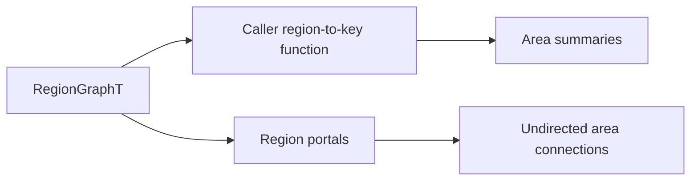

# Spatial Coordination

The spatial-coordination layer provides game-agnostic derived indexes and
coordination primitives. Applications supply semantic keys, scores, entity
identities, and policies; tess owns deterministic grouping and bounded
scratch. It does not define rooms, factions, combat meaning, or pawn AI.

## Area Index

`include/tess/spatial/area.h` groups topology regions by a caller-supplied
nonzero `std::uint64_t` key. This deliberately builds on `RegionGraphT`
instead of adding a second tile flood:

`AreaId` is 1-based within one built index; `invalid_area_id` is zero.
`AreaSummary` reports the semantic key, region and tile counts, and unioned
world bounds. `AreaConnection` canonicalizes an undirected pair of area IDs
and counts the directed region portals crossing between them. Multiple regions
with the same key become one area even when disconnected; connectivity remains
available from the underlying region graph. Returning key zero omits a region.

`build_area_index(graph, grouper, scratch, index)` assigns IDs by ascending
semantic key, so callback and graph traversal order cannot change identities.
It supports dense and sparse graphs and uses `AreaIndexScratch` for reusable
keys and edge sorting. `AreaIndex::reserve` plus `AreaIndexScratch::reserve`
make a warm rebuild allocation-free when capacities suffice.
`AreaBuildResult` reports the resulting counts and an `AreaBuildStatus` of
`Built` or `TooManyAreas` if 32-bit identifiers cannot represent every unique
key.

Lookups accept either a `RegionRef` or a graph plus world coordinate. An index
is bound to the exact graph object and its monotonic `revision()`.
`is_valid(graph)` is O(1), and coordinate lookup adds only region lookup plus
the area's ordered-region lookup; neither rescans portals. Both reject an
index after the graph changes, so rebuild it after topology maintenance. The
graph-aware calls borrow that exact object: it must remain alive, and callers
must clear or rebuild the index before destroying the graph or constructing a
different graph in the same storage. Summaries and `RegionRef` lookup remain
index-owned.

This is an area substrate, not a room model. The application decides whether a
key means a room, district, biome, work zone, tactical sector, or nothing at
all, and owns names, membership policy, ownership, statistics, and lifecycle.

## Tactical Assignment

`include/tess/spatial/tactical_assignment.h` provides the deliberately named
`assign_tactical_candidates_greedy` primitive. `TacticalRequest` carries a
stable requester ID, origin, and priority; `TacticalCandidate` carries a
stable candidate ID, position, and capacity. The caller's scorer returns a
`TacticalScore` whose feasibility flag filters illegal pairs and whose signed
value is lower-is-better.

The pass processes higher priorities first, then lower requester IDs. It picks
the lowest score with candidate ID as the final tie break and decrements
capacity. `TacticalAssignment` rows remain aligned with request input order,
including explicit unassigned rows. `TacticalAssignmentResult` reports the
assigned count and `TacticalAssignmentStatus` (`Complete`, `Partial`, or
`InvalidInput` for duplicate stable IDs). Returned rows borrow
`TacticalAssignmentScratch` until its next pass; reserve makes warm assignment
allocation-free.

The algorithm is intentionally greedy, not a claim of globally minimum-cost
matching. It is suitable for cover slots, work positions, rally points, or
other scarce candidates where applications want a predictable fast baseline.
Applications needing a global optimum can use the same request, candidate, and
score vocabulary with their own matching solver.

## Local Move Coordination

`include/tess/spatial/local_coordination.h` resolves a caller-generated set of
nearby destination options without owning steering or path planning. Each
`LocalMoveRequest` identifies an agent, current coordinate, priority, and a
non-overlapping range in a flat `LocalMoveOption` array. The caller's predicate
decides whether each option is currently legal, so world bounds, movement
class, occupancy, reservation, clearance, and application rules stay outside
the generic resolver. The predicate must be deterministic and side-effect
free; the resolver evaluates it exactly once per referenced option.

Higher priority moves claim first, with stable agent ID as the final request
tie break. Each request chooses the lowest preference among unclaimed feasible
destinations and breaks equal preferences lexicographically by coordinate.
`LocalMoveDecision` rows remain aligned with input requests and explicitly
report `LocalMoveDecisionStatus::Reserved` or
`LocalMoveDecisionStatus::Wait`. `resolve_local_moves` returns a
`LocalCoordinationResult` whose `LocalCoordinationStatus` distinguishes
complete, partial, and invalid inputs. A reserved decision is permission for
the caller to form and validate its normal `MovementIntent`; it does not
mutate a world or bypass commit-time validation.

The same pass emits coordinate-sorted `LocalCongestion` summaries. `demand`
counts distinct requests with a feasible option for that coordinate and
`reserved` counts accepted claims. Callers may publish those counts into a
bounded congestion field or diagnostics without a hidden full-world product.
Returned spans borrow `LocalCoordinationScratch`; reserve makes the warm pass
allocation-free.

This is deterministic local arbitration, not continuous steering, collision
prediction, formation control, or globally optimal multi-agent pathfinding.
The conservative caller predicate can reject currently occupied destinations,
which also rejects swaps and move-through cycles under the existing movement
commit contract.
