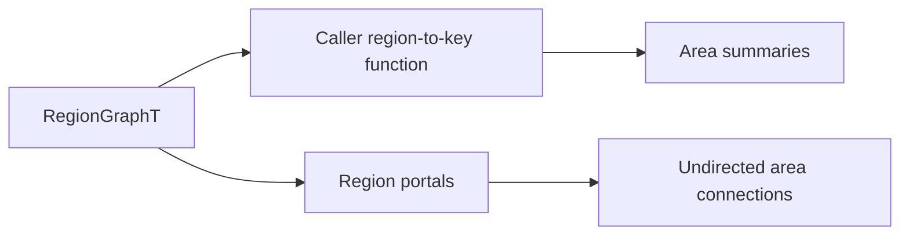

# Spatial Coordination

The spatial-coordination layer provides game-agnostic derived indexes and
coordination primitives. Applications supply semantic keys, scores, entity
identities, and policies; tess owns deterministic grouping and bounded
scratch. It does not define rooms, factions, combat meaning, or pawn AI.

## Area Index

`include/tess/spatial/area.h` groups topology regions by a caller-supplied
nonzero `std::uint64_t` key. This deliberately builds on `RegionGraphT`
instead of adding a second tile flood:

`AreaId` is 1-based within one built index; `invalid_area_id` is zero.
`AreaSummary` reports the semantic key, region and tile counts, and unioned
world bounds. `AreaConnection` canonicalizes an undirected pair of area IDs
and counts the directed region portals crossing between them. Multiple regions
with the same key become one area even when disconnected; connectivity remains
available from the underlying region graph. Returning key zero omits a region.

`build_area_index(graph, grouper, scratch, index)` assigns IDs by ascending
semantic key, so callback and graph traversal order cannot change identities.
It supports dense and sparse graphs and uses `AreaIndexScratch` for reusable
keys and edge sorting. `AreaIndex::reserve` plus `AreaIndexScratch::reserve`
make a warm rebuild allocation-free when capacities suffice.
`AreaBuildResult` reports the resulting counts and an `AreaBuildStatus` of
`Built` or `TooManyAreas` if 32-bit identifiers cannot represent every unique
key.

Lookups accept either a `RegionRef` or a graph plus world coordinate. An index
is bound to the exact graph object and a fingerprint of its public topology
versions, regions, and portals. `is_valid(graph)` and coordinate lookup reject
an index after the graph changes; rebuild it after topology maintenance.

This is an area substrate, not a room model. The application decides whether a
key means a room, district, biome, work zone, tactical sector, or nothing at
all, and owns names, membership policy, ownership, statistics, and lifecycle.
