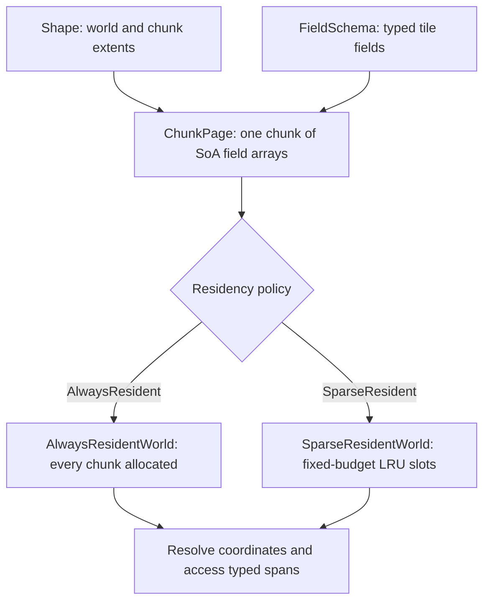
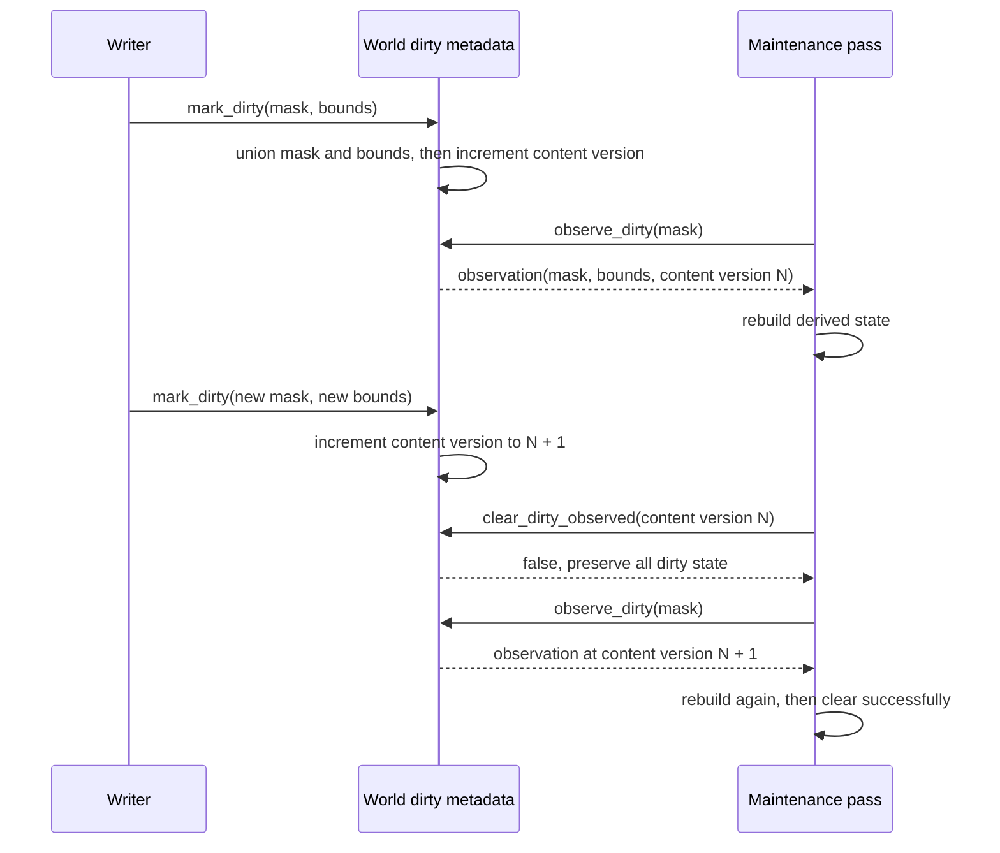

# Storage Foundation

The implemented storage foundation covers typed compile-time field schemas,
resident chunk pages, an always-resident dense world owner, and per-chunk
metadata for dirty/active tracking. It implements the early storage slices of
the historical [chunk storage TDD][storage-tdd].

[storage-tdd]: https://github.com/kindjie/tess/blob/main/docs/tdd/core-chunk-storage.md



## Field Schemas

Tile fields are declared with `tess::Field<Tag, Value>`, where `Tag` is a
user-defined type and `Value` is the stored tile value type. Tags are type
handles; string or name lookup remains outside the current implementation.
`Value` must satisfy `TileFieldValue`: it is an unqualified,
nothrow-default-constructible object that is trivially copyable, trivially copy
assignable, and trivially destructible. This keeps page reset deterministic and
non-throwing. Persistability remains a narrower, separate archive contract.

`tess::FieldSchema<Fields...>` rejects duplicate tag types at compile time and
exposes:

- `field_count`
- `contains<Tag>`
- `value_type<Tag>`

The public `tess::is_valid_field_schema_v<Fields...>` helper detects duplicate
tags without intentionally instantiating an invalid schema.

## Chunk Page

`tess::ChunkPage<Shape, Schema>` stores one resident chunk worth of tile data.
Fields are owned directly by the page object as chunk-local SoA arrays:

<!-- tess-snippet: storage-field-array source=examples/documentation.cc -->
```cpp
template <typename Value>
using ChunkFieldStorage =
    std::array<Value, tess::ShapeTraits<MyShape>::local_tile_count>;
```
<!-- /tess-snippet -->

The page owns inline, value-initialized storage and performs no Tess-owned
runtime allocation. `reset()` value-initializes every field in place and cannot
throw. Hot code can access each field through
contiguous typed spans:

<!-- tess-snippet: storage-page-access source=examples/documentation.cc -->
```cpp
auto terrain = page.field_span<TerrainTag>();
page.field<CostTag>(tess::LocalTileId{42}) = 3.0F;
```
<!-- /tess-snippet -->

Const pages return `std::span<const Value>` and `const Value&`.

## Metadata

Each page stores the chunk identity passed at construction:

- `ChunkKey`
- `ChunkCoord3`

The page type also exposes:

- `local_tile_count`
- `field_count`
- `byte_size`

`byte_size` reports the owned field-array storage, not object padding or
metadata bytes.

## Always-Resident World

`tess::World<Shape, Schema, tess::AlwaysResident>` owns one
`tess::ChunkPage<Shape, Schema>` for every chunk in the shape. The convenience
alias `tess::AlwaysResidentWorld<Shape, Schema>` names the same type.

Pages live in a `std::vector` populated during world construction. Construction
may allocate and throw. The vector is filled in `ChunkKey` order, and each page
stores matching `ChunkKey` and `ChunkCoord3` metadata derived from the public
shape key conversion helpers.

The world type exposes static storage metadata:

- `chunk_count`
- `local_tile_count`
- `field_count`
- `page_byte_size`
- `storage_byte_size`

These constants count Tess-owned inline page storage. They exclude dynamic
storage and referenced objects managed by field values.

`fill_field<Tag>(value)` assigns one value to the selected field across every
tile in a dense world. The traversal and `TileFieldValue` assignment perform
no allocation and cannot throw. The method is intentionally absent from the
sparse world: “every tile” would otherwise ambiguously mean every resident
tile or materializing the complete bounded shape. Like direct `field()`
writes, filling storage does not update dirty, active, topology, or
content-version metadata.

Hot accessors are explicitly `noexcept` and do not allocate after
construction:

<!-- tess-snippet: storage-dense-world source=examples/documentation.cc -->
```cpp
tess::AlwaysResidentWorld<MyShape, MySchema> dense_world;
auto pages = dense_world.chunks();
auto& page = dense_world.chunk(tess::ChunkKey{3});
auto resolved = dense_world.resolve(tess::Coord3{10, 20, 0});
dense_world.field<TerrainTag>(tess::Coord3{10, 20, 0}) = 7;
auto terrain = dense_world.field_span<TerrainTag>(tess::ChunkKey{3});
```
<!-- /tess-snippet -->

Unchecked accessors require valid chunk keys, chunk coordinates, and tile
coordinates. Checked `try_*` accessors return `nullptr` or `std::nullopt` for
out-of-bounds input.

## Sparse-Resident World

`tess::World<Shape, Schema, tess::SparseResident>` (alias
`tess::SparseResidentWorld<Shape, Schema>`) materializes only a byte-budgeted
subset of a bounded shape, so a world spanning trillions of chunks costs only
its residency budget rather than `chunk_count` pages. It is constructed with a
`tess::ResidencyConfig{byte_budget}`; the resident capacity is
`byte_budget / page_byte_size` (at least one chunk). These byte counts cover
Tess-owned inline page storage, not dynamic storage or referenced objects a
field value manages. Construction allocates the fixed slot pool and directory
once and never reallocates them.

Residency is managed explicitly:

<!-- tess-snippet: storage-sparse-world source=examples/documentation.cc -->
```cpp
tess::SparseResidentWorld<HugeShape, MySchema> sparse_world{
    tess::ResidencyConfig{budget}};
const auto handle = sparse_world.ensure_resident(tess::ChunkKey{0});
sparse_world.chunk(tess::ChunkKey{0})
    .field<TerrainTag>(tess::LocalTileId{0}) = 7;
```
<!-- /tess-snippet -->

- `ensure_resident(key)` materializes the chunk (evicting the
  least-recently-used chunk when the budget is full), marks it
  most-recently-used, and returns a `tess::ResidencyHandle`. It is idempotent:
  an already resident chunk keeps its data and generation. An intrusive
  doubly-linked LRU over slot indices makes victim selection and recency
  updates O(1), independent of the resident capacity; its link arrays are
  allocated with the fixed slot pool. A budget smaller than one page clamps
  the capacity to one chunk rather than producing an unusable zero-capacity
  world.
- `touch(key)` refreshes recency; `evict(key)` releases a chunk immediately.
- `is_resident(key)` distinguishes a resident chunk from a `Missing` one;
  `contains(key)` reports only in-bounds-ness. Both differ from out-of-bounds.
- Unchecked `chunk`/`meta` accessors require residency; `try_chunk`/`try_meta`
  and `try_field` return `nullptr` for a non-resident (or out-of-bounds) chunk.
  Residency-tolerant path readers use these accessors to apply their selected
  missing-chunk policy.

Eviction and rematerialization are generation-safe. Each residency assigns a
world-monotonic generation that is never reused, so a `ResidencyHandle` taken
before an eviction never validates (`world.valid(handle)` returns `false`)
against the rematerialized chunk, which reuses the key but receives a strictly
greater generation. A rematerialized chunk is a fresh, value-initialized page — evicted data is
ended. `residency_generation(key)` returns an invalid
`ResidencyGeneration{}` for a non-resident chunk.

`resident_chunk_keys()` enumerates exactly the resident set, and the
dirty- and active-mask queries and `mark_*` helpers behave identically to the dense world
but iterate only resident chunks. No accessor or query scans `0..chunk_count`,
preserving the "no hidden full-world scans" invariant at sparse scale. The
directory uses a direct key-to-slot array when the residency capacity covers
the bounded world's complete chunk key space. Larger key spaces use a
fixed-capacity open-addressing map with backward-shift deletion. Both forms
allocate once; long-lived eviction/rematerialization churn reallocates nothing, and the
hashed form accumulates no tombstones. Both worlds share one `ChunkMeta`
mutation implementation (`tess/storage/chunk_meta.h`), so dirty masks, active
masks, and content-version semantics are identical.

## Chunk Metadata

Each always-resident world owns one cold `tess::ChunkMeta` per resident page in
matching `ChunkKey` order, plus world-owned parallel arrays for fields scanned
frequently. A new chunk therefore has this combined state:

- `world.chunk_activity(key) = tess::ChunkActivity::Sleeping`
- `content_version = tess::ContentVersion{}`
- `topology_version = tess::TopologyVersion{}`
- `world.active_category_count(key) = 0`
- `entity_count = 0`
- `world.dirty_mask(key) = tess::DirtyMask{}`
- `world.active_mask(key) = tess::ActiveMask{}`
- `world.dirty_bounds(key) = {}`

Direct metadata lookup mirrors page lookup:

<!-- tess-snippet: storage-metadata source=examples/documentation.cc -->
```cpp
auto& meta = dense_world.meta(tess::ChunkKey{3});
auto* checked = dense_world.try_meta(tess::ChunkCoord3{3, 0, 0});
```
<!-- /tess-snippet -->

These direct accessors are `noexcept` and do not allocate, but a `ChunkMeta`
reference does not contain the complete dirty/active state. Dirty masks, active
masks, and dirty bounds must be read through the world accessors and mutated
through its `mark_*`, `clear_*`, and observation APIs. Keeping those hot-scan
columns out of `ChunkMeta` avoids pulling cold counters into bulk queries.

`DirtyMask` and `ActiveMask` are explicit 32-bit bit sets. `mark_dirty` unions
dirty bounds and increments the content version; `clear_dirty` clears selected
bits and resets bounds when no dirty bits remain. `mark_active` and
`clear_active` mutate the active mask; `chunk_activity` and
`active_category_count` derive from that single authority.
`mark_topology_dirty` applies dirty metadata and increments both the content
version and topology version. `mark_topology_rebuilt` increments only the
topology version so topology products can observe rebuild/replacement events.
`mark_content_changed` increments only the content version. It invalidates
content-version-keyed caches and earlier `DirtyObservation`s without changing
dirty masks or bounds, topology metadata, activity, or sparse residency state.
Use `mark_dirty` when dirty-metadata consumers must observe the edit,
`mark_topology_dirty` when topology freshness must change, and the schedule's
notification protocol when an OnDirty task must run.

Maintenance passes that rebuild derived state use the generation-stamped
observe/clear pair instead of raw `clear_dirty`. `observe_dirty(key, mask)`
snapshots the requested dirty subset, the dirty bounds, the content version,
and the residency generation into a `DirtyObservation`.
`clear_dirty_observed(key, observation)` clears exactly the observed mask bits
only while both stamps still match; any `mark_dirty` or
`mark_content_changed` that lands after the observation advances the version,
so a stale clear leaves every mask bit and bound in place and returns `false`, and
the caller re-observes before clearing. This prevents a serialized
intervening change from being erased; it does not make simultaneous
unsynchronized world mutation thread-safe. This is the dirty metadata
protocol required before concurrent or budgeted maintenance may clear masks
it did not fully rebuild.

The residency generation scopes an observation to a single residency
interval. A sparse world assigns a fresh `ChunkMeta` when it rematerializes a
chunk,
restarting its content version at zero, so content-version equality alone would let an
observation taken before an eviction match a mark made after rematerialization and
clear work it never saw. An always-resident world never evicts and carries
zero on both sides.



`dirty_chunks(mask)` and `active_chunks(mask)` return matching `ChunkKey`
values in key order. These query helpers allocate their returned vectors; they
are intended for planner/domain construction, not inner tile loops.
`collect_dirty_chunks(mask, out)` and `collect_active_chunks(mask, out)`
append the same keys to a caller-owned vector and do not allocate when the
caller has reserved enough capacity; the by-value queries are thin wrappers
over them.

## Out Of Scope

Sparse residency, the `ChunkDirectory`, per-chunk generations, and byte-budget
eviction are implemented (see Sparse-Resident World). The
[topology](topology.md) and [path](path.md) layers build on the
residency-tolerant `try_*` readers to run supported APIs natively over sparse
worlds and report `Indeterminate` when non-resident space prevents a definitive
answer. Still out of scope in this layer: typed dirty/active vocabularies, full
lifecycle states beyond sleeping/active, on-demand chunk materialization
policy, thread ownership policies, block generation, and planner domains.
