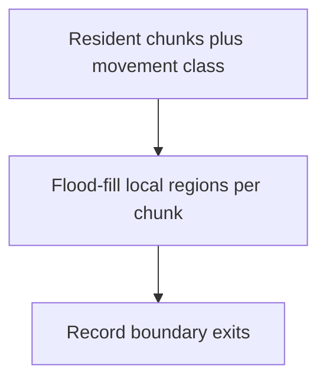
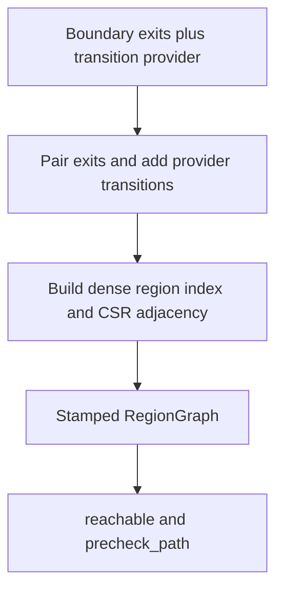

# Topology Foundation

The current topology layer is a local chunk-region foundation. It lives under
`include/tess/topology/` and is exported by `tess/tess.h`.

## Region Graph Pipeline

### Construction

Local labeling depends only on resident chunks and the normalized movement
class predicate.



The graph builder then combines ordinary boundary adjacency with optional
provider transitions.



### Incremental Updates

```mermaid
stateDiagram-v2
  accTitle: Region-graph incremental update
  accDescr: Dirty chunks are patched only while graph stamps match; otherwise the builder performs a full rebuild.

  [*] --> CheckStamps: dirty chunks plus face neighbors
  CheckStamps --> Patch: stamps match
  CheckStamps --> FullRebuild: stamp mismatch
  Patch --> Reindex: relabel and replace affected portals
  Reindex --> [*]: rebuild dense index and CSR adjacency
  FullRebuild --> [*]
```



## Public Surface

- `LocalRegionId` identifies one passable connected component inside one
  chunk. Ids are 1-based: `invalid_local_region` (value 0) is used for
  blocked tiles and invalid lookups, and id N maps to `regions()[N - 1]`.
- `LocalRegion` summarizes one local region with tile count, world-space
  bounds, and boundary-exit count.
- `LocalBoundaryExit` records one passable local boundary tile that has an
  adjacent resident chunk in the compile-time shape, including which
  `BoundaryFace` it crosses (`NegativeX` through `PositiveZ`) and the
  target `ChunkKey`.
- `LocalChunkTopology` owns local region labels, region summaries, boundary
  exits, the chunk key, and the captured chunk topology version.
  `region(LocalRegionId)` is the checked accessor for the 1-based id
  convention; it returns `nullptr` for invalid or out-of-range ids.
- `LocalTopologyScratch` owns reusable flood-fill stack storage.
- `RegionRef` identifies a local region in a specific chunk.
- `RegionPortal` records one directed passable transition between neighboring
  chunk-local regions.
- `RegionGraphT<Residency>` owns all local chunk topologies, paired directed
  portals, and a global region index with a CSR portal adjacency.
  `region_count()` reports the index size and `region_index(RegionRef)` maps a
  region reference to its index (`invalid_region_index` for invalid or
  out-of-range references). It is a class template on the world residency
  policy: `RegionGraph` (the alias `RegionGraphT<AlwaysResident>`) is the dense
  graph and indexes its containers directly by chunk key; `SparseRegionGraph`
  (`RegionGraphT<SparseResident>`) is built only over a world's resident chunk
  set, sized by the resident count rather than the total chunk count, and
  resolves a chunk key to a local index through a frozen, sorted key table
  (`std::lower_bound`) so the graph is self-contained and cannot be invalidated
  by later eviction. All existing dense call sites are unchanged via the alias,
  and dense codegen is byte-identical (every sparse branch is behind
  `if constexpr`; the sparse-only state is empty for a dense graph).
- `RegionGraphScratch` owns reusable reachability traversal storage with
  epoch-stamped visited marks.
- `LocalTopologyResult` summarizes one build: a `TopologyStatus` (`Built`,
  `InvalidChunk` for an out-of-range chunk key, or `MissingChunk` when a
  sparse local build names a valid non-resident chunk), region count, passable
  tile count, boundary exit count, and the captured topology version. The
  chunk and graph builders below all return it.
- `build_local_chunk_topology<World, ClassOrTag>(world, chunk, scratch,
  topology)` labels passable connected components for one chunk and records
  boundary exits. A sparse build rejects a non-resident chunk before accessing
  page storage and returns `MissingChunk` with an empty topology. The second
  template argument is a movement class OR a raw passable tag: a raw tag
  normalizes to the `WalkableField` identity class,
  whose flood stays the byte-identical legacy `field_span` scan; a composed
  class evaluates its predicate on the resolved page per tile.
- `build_region_graph<World, ClassOrTag>(world, scratch, graph, provider =
  AdjacentTransitions{})` rebuilds local topology, pairs boundary exits whose
  neighbor tile is passable, appends the transition provider's extra directed
  portals (see Transition Providers below), and rebuilds the region index and
  CSR adjacency. It also stamps the graph with the normalized movement-class
  identity (see `matches_class` below) and the provider type plus revision.
  Portal
  pairing needs no class awareness: it queries labels, so per-class labels
  yield per-class portals automatically. The graph type is deduced from
  the world's residency: a dense world rebuilds every chunk; a sparse world
  builds only its resident chunks (sorted ascending) and freezes their keys and
  residency generations onto the graph.
- `update_region_graph<World, ClassOrTag>(world, scratch, graph,
  dirty_chunks, provider = AdjacentTransitions{})` incrementally patches a
  built graph after passability edits
  confined to the dirty chunks and returns the same aggregate result a full
  rebuild would. On a sparse world it first checks the frozen residency
  snapshot (resident count plus per-key generation); any residency change since
  the build forces a full rebuild rather than trusting a stale graph. A
  movement-class mismatch (the graph was built for a different class) likewise
  forces a full rebuild with the requested class's labels, as does a
  transition-provider type or revision mismatch (`matches_provider`).
- `RegionGraphT::matches_class<ClassOrTag>()` reports whether the graph was
  built for the given class (normalized, so a raw tag and its `WalkableField`
  identity agree). The stamp is a runtime class-identity token captured at
  build time, mirroring the shape binding: the graph type encodes neither, so
  a graph labeled for one class must never answer reachability for another.
  False until the first build.
- `reachable<Shape>(graph, start, goal, scratch)` checks whether two
  coordinates are connected through local regions and paired portals. It
  returns a `ReachabilityResult`: a `ReachabilityStatus` (`Reachable`,
  `Unreachable`, `InvalidStart`, or `InvalidGoal`) plus the number of visited
  regions. On a sparse graph it also returns `Indeterminate`: a non-resident
  endpoint, or a BFS that exhausts without reaching the goal while touching a
  region that exits into a non-resident chunk, yields `Indeterminate` rather
  than a wrong `Unreachable`. A route found within the resident set still wins
  (`Reachable`), and a component fully enclosed by resident walls is a definite
  `Unreachable`.
- `is_region_graph_fresh(world, graph)` reports, without mutating anything,
  whether a built graph still matches the world: every chunk's stored topology
  version is current (dense and sparse) and, on a sparse world, the frozen
  residency snapshot still holds (resident count plus per-key generation). It
  recomputes the same staleness test `update_region_graph` applies internally,
  so a reachability precheck can consult it and fall back to A* on a stale
  graph rather than trust a definitive but outdated `Unreachable`. Allocation-
  free; O(chunk_count) dense, O(resident_count) sparse.
- `is_region_graph_fresh_for<ClassOrTag>(world, graph)` is the class-aware
  form: additionally requires `matches_class<ClassOrTag>()`, so a graph
  labeled for another movement class is not fresh for this one even when every
  topology version is current — its labels answer a different passability
  question. The class is the explicit first template argument; `World` stays
  deduced.

## Behavior

Orthogonal local topology uses six axis-adjacent movement inside one chunk:

```text
+x, -x, +y, -y, +z, -z
```

Degenerate axes naturally have no local neighbor candidates. Boundary exits
are emitted only when the passable boundary tile has a neighboring chunk inside
the compile-time shape, so single-chunk and degenerate-axis worlds do not
create synthetic exits.

Axial-hex topology instead uses its six regular axial directions, including
the two cross-axis chunk seams. Diagonal policies retain orthogonal local
components because every legal diagonal has a clear face-connected route;
this projection preserves reachability while exact path costs still use the
diagonal model.

The builder treats the passability field as boolean-like. Blocked tiles keep
`invalid_local_region`. Region IDs are assigned deterministically in increasing
local tile order, then depth-first flood fill order. The result captures
`world.meta(chunk).topology_version`; this slice does not mutate dirty flags or
metadata versions.

`RegionGraph` pairs exits by looking at the adjacent world coordinate across
each boundary exit. If that tile belongs to a passable local region in the
neighboring chunk, a directed `RegionPortal` is emitted. Portals are stored
in canonical build order: ascending from-chunk, then boundary-exit order
within the chunk. After pairing, the builder assigns every region a dense
global index (per-chunk prefix sums over 1-based local ids) and fills a CSR
adjacency over portals, preserving portal order within each from-region
bucket for deterministic traversal.

Reachability first maps endpoints to local regions, rejects blocked or
out-of-shape endpoints, and then runs the traversal over the CSR adjacency
using dense region indices and epoch-stamped visited marks, which makes one
query O(regions + portals) instead of rescanning the portal array per
frontier pop. Visited-region counts are unchanged from the portal-scan
implementation because the CSR buckets preserve portal order.

`update_region_graph` patches a built graph in place. It re-runs
`build_local_chunk_topology` for each dirty chunk, drops every portal
originating from a dirty chunk or one of its face neighbors in one filtered
pass, re-derives those chunks' portals from their boundary exits, and
stable-sorts portals by from-chunk to restore canonical build order before
rebuilding the dense index and CSR adjacency. The result is identical to a
fresh `build_region_graph` over the edited world, including portal order.
An empty dirty set is a no-op; a dirty set covering all chunks is
equivalent to a full build. Passing a graph that was never built for the
world shape falls back to a full build, and an out-of-range dirty chunk is
rejected with `InvalidChunk` before any mutation.

## Movement Vocabulary

`include/tess/topology/movement_class.h` (namespace `tess::movement`) defines a
compile-time DSL for describing how a class of agent moves, so labeling,
pathfinding, and commit validation can share ONE vocabulary. A
`MovementClass<PassExpr, CostExpr, StepPolicy>` fuses a passability predicate,
an entry-cost expression, and a regular-step policy. `StepPolicy` defaults to
`DefaultSteps`, so existing two-argument declarations retain their type and
behavior. Each expression is composed from typed-field leaves that read the
constexpr `ChunkPage::field<Tag>(LocalTileId)` at the `(page, tile)` seam
(world-scope accessors are not constexpr). The whole predicate inlines to the
same `&&`/`||`/`!` a hand-written cast emits, so threading a class through the
hot paths keeps single-field codegen.

Every movement class derives from `movement_class_tag`; the tag is the public
marker used by compile-time validation and normalization.

- Step policies: `DefaultSteps` selects the lattice default;
  `DiagonalSteps<CornerRule>` selects clearance-preserving diagonals with
  `RequireBothClear` or `RequireOneClear`. `step_policy_of<Class>` supplies
  `DefaultSteps` for legacy custom classes without a member, while
  `StepPolicyFor<Policy, Shape>` rejects diagonals unless the shape is an
  orthogonal lattice with exactly two effective axes. Policy types expose
  stable `StepPolicyIdentity` and positive fixed-point cost scales;
  `ValidCornerRule` closes the diagonal rules, while
  `step_policy_identity`, `step_policy_identity_of`, and `step_policy_of`
  expose their normalized identities.
- Boolean terms: `Field<Tag>` (truthy), `NotZero<Tag>` (non-zero integral),
  `Not<Term>`, `AllOf<Terms...>`, `AnyOf<Terms...>`.
- Cost expressions (0 == impassable, u32-saturated): `UnitCost`,
  `ConstantCost<N>`, `FieldCost<CostTag>`, `SelectCost<SelTag, WhenSet,
  WhenClear>`. `normalize_cost` is byte-exact with the weighted A* leaf.
- Identity classes for backward compatibility: `WalkableField<PassableTag>`
  (unweighted; carries the raw tag and a `passable_span` fast path so the
  identity region flood stays a byte-identical `field_span` scan),
  `WalkableCostField<PassableTag, CostTag>` (weighted, cost>0 folded into
  passability), and `LegacyWeighted<PassableTag, CostTag>` (the legacy
  cost-agnostic asymmetry). `movement_class_of<T>` normalizes a raw tag OR a
  class so every legacy `<World, PassableTag>` call site compiles unchanged.
- `MovementClassFor<Class, World>` checks the full predicate/cost contract;
  `HasPassableSpan<Class, Page>` identifies the single-field fast path used by
  compatible topology and path builders.

Per-class region labeling and the graph class stamp are wired (S5.3): the
labeling builders take a class or tag, and `RegionGraphT` records the
normalized class identity it was built for. Precheck agreement (S5.4), commit
validation (S5.5), and the class-aware agent tick plus runtime class binding
(S5.6) thread the same vocabulary through the path layer.

## Resolved Transitions

`ResolvedTransitionModel<World, ClassOrTag, Provider>` is the shared,
allocation-free edge authority used by exact search, reverse fields, field
products, topology, caches, path agents, and movement validation.
`ForwardTransitionModelFor` and `ReverseTransitionModelFor` check its hot
callback contracts. Each
`TransitionProbe` reports the target, compact cost, `TransitionKind`, and
three-valued `TransitionAvailability` (`Legal`, `Blocked`, or
`MissingTopology`).

Orthogonal default steps retain `+x, -x, +y, -y, +z, -z` order and scale one.
Diagonal policies emit face steps first and then four planar diagonals, use
128/181 fixed-point cardinal/diagonal costs, and test the movement class on
both clearance tiles according to the selected corner rule. Axial-hex default
steps emit `(+1,0), (-1,0), (0,+1), (0,-1), (+1,-1), (-1,+1)` at scale one.
Model identity includes normalized class, lattice identity/version, step
policy, cost scale, and provider type/revision; fields, products, graphs, and
caches reject a mismatched stamp. Regular transitions are enumerated before
special transitions.

## Transition Providers

`include/tess/topology/transition_provider.h` defines the
`TransitionProviderFor<P, World>` concept: a provider contributes EXTRA
directed tile-to-tile transitions to the region graph beyond the built-in
six-axis face adjacency (stairs, ladders, and similar special movement).
`build_region_graph` and `update_region_graph` take an optional trailing
provider (default `AdjacentTransitions`, which contributes nothing and is
byte-identical to the providerless build). The builders enumerate a provider
once per chunk (`for_each_transition(world, chunk, sink)`, `from` inside the
chunk) and append one directed `RegionPortal` per transition whose endpoints
both resolve to labeled regions — so provider edges are automatically
per-class, and a bidirectional passage emits each direction from its own
chunk. The landing tile must lie in the same chunk or a face-neighbor chunk
(asserted in debug builds): incremental updates re-derive portals only for
dirty chunks and their face neighbors, so a longer-range transition would
survive, stale, past an edit to its landing chunk. The provider type and
revision are stamped on the graph like the movement class
(`matches_provider`). Empty providers use revision zero. A stateful provider
must expose `transition_revision() const noexcept -> std::uint64_t` and advance
it whenever its emitted edge set can change; `update_region_graph` falls back
to a full rebuild when either provider stamp changes. On a sparse world, a
provider transition landing in a non-resident
chunk marks its origin region as reaching missing topology, so reachability
degrades to `Indeterminate` rather than a wrong `Unreachable`; that
reaches-missing pass re-enumerates every resident chunk's provider
transitions after each build or incremental update (index flags are
reassigned wholesale), so a provider's enumeration cost bounds sparse
update cost regardless of the dirty-set size.

Exact forward search additionally requires
`ForwardTransitionProviderFor<P, World>` and allocation-free
`for_each_forward(world, origin, sink)` enumeration. Reverse fields require
`ReverseTransitionProviderFor<P, World>` and
`for_each_reverse(world, target, sink)`. Each sink receives a
`SpecialTransitionCandidate` containing the other endpoint, a positive cost
in unscaled movement-class entry-cost units, and an optional
`missing_topology` marker. The resolved model applies its cardinal scale; a
provider must not pre-scale the value. A zero cost contributes no legal edge.
Providers may publish `maximum_transition_cost` as a sound compile-time bound.
The empty and stair providers implement both exact contracts; topology-only
custom providers remain valid for graph construction.

## Stairs

`StairTransitions<StairTag>` is the concrete vertical provider: an integral
`StairTag` field holds a `StairDirection` (`None`/`PositiveX`/`NegativeX`/
`PositiveY`/`NegativeY`), and a non-`None` tile is the FOOT of a stair whose
landing is one step in that direction and one z-level up. The offset is
deliberate — two vertically stacked passable tiles are already six-axis
adjacent, so a same-column stair would add nothing. Each stair contributes
both directions, each emitted from the chunk owning its origin tile (the down
direction from the landing's chunk, which is the foot's chunk or its +z face
neighbor), so incremental re-derivation holds. Whether either endpoint is
traversable stays a movement-class question: stair edges are automatically
per-class through the label filter. Limit: a landing that would cross two
chunk boundaries at once (sideways off the chunk's x/y edge AND up off its
top z layer) violates the face-neighbor contract and contributes nothing;
place the foot so the landing stays within face-neighbor range.
Each stair edge has provider cost one, so it costs one cardinal step under any
resolved step policy and does not inherit the landing tile's terrain cost.

## Deliberate Limits

This slice does not implement a dirty rebuild queue. The portal graph stores directed
portals only; incremental updates require the caller to supply the dirty
chunk set, and provider transitions must stay within face-neighbor range.
