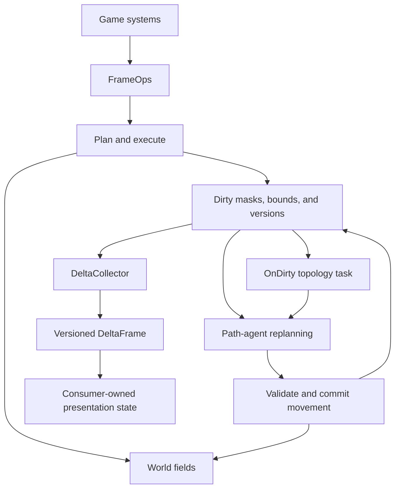

# Getting Started

This tutorial climbs the `tess` concept ladder in the order the pieces
compose: shapes, schemas, worlds, writes, pathfinding, topology, the
schedule loop, and the render bridge. Each stage links the maintained
architecture note and a runnable example. Every example is a
self-checking binary built by the `examples` and `dev` presets (see the
[contributor guide](https://github.com/kindjie/tess/blob/main/CONTRIBUTING.md)).

The pieces form one dirty-driven data flow. Callers own the queue, schedule,
agent storage, and presentation state; tess connects those objects without
owning an engine loop.



Consume the library per the [installation guide](packaging.md) (installed
package, `FetchContent`, or `add_subdirectory`), link `tess::tess`, and
include the pathfinding facade:

<!-- tess-snippet: getting-pathfinding-include source=examples/documentation.cc -->
```cpp
#include <tess/pathfinding.h>
```
<!-- /tess-snippet -->

## 1. Shape: the compile-time world model

A `tess::Shape` fixes the world and chunk dimensions at compile time.
Chunk dimensions must be powers of two that evenly divide the world
dimensions; both are `tess::Extent3` values.

<!-- tess-snippet: getting-shape source=examples/documentation.cc -->
```cpp
using Shape = tess::Shape<tess::Extent3{32, 32, 1}, tess::Extent3{8, 8, 1}>;
```
<!-- /tess-snippet -->

One model covers 2D (`z = 1`), vertical cross-sections (`y = 1`), and
full 3D - degenerate axes cost nothing. All world-space APIs use signed
`tess::Coord3` coordinates.

- Architecture: [`architecture/shape.md`](architecture/shape.md)
- Example: `examples/ant_farm_vertical.cc` (a degenerate-axis x-z world)

## 2. FieldSchema: what each tile stores

Fields are declared with empty tag types plus a stored value type, and
collected into a `tess::FieldSchema`. Tags are type-level names: they
never exist at runtime.

<!-- tess-snippet: getting-schema source=examples/documentation.cc -->
```cpp
struct PassableTag {};
struct CostTag {};
struct ConstructionTag {};

using Schema = tess::FieldSchema<tess::Field<PassableTag, std::uint8_t>,
                                 tess::Field<CostTag, std::uint32_t>,
                                 tess::Field<ConstructionTag, std::uint8_t>>;
```
<!-- /tess-snippet -->

Storage is struct-of-arrays per chunk: each field is a contiguous span
per chunk page, which is what the block kernels and path queries iterate.

- Architecture: [`architecture/storage.md`](architecture/storage.md)

## 3. World: residency policies

A world binds a shape and schema to a residency policy:

<!-- tess-snippet: getting-world source=examples/documentation.cc -->
```cpp
using World = tess::AlwaysResidentWorld<Shape, Schema>;
World world;  // Allocates every chunk; all fields are zero-initialized.
```
<!-- /tess-snippet -->

`AlwaysResidentWorld` keeps every chunk allocated - the simplest choice
and the right default for small or dense worlds. `SparseResidentWorld`
(see `tess/storage/sparse_world.h`) materializes chunks on demand under
a byte-budgeted residency manager for large or mostly-empty worlds.
Zero-initialized fields mean a fresh world is fully blocked for the
identity movement class below: open tiles before pathing.

- Architecture: [`architecture/storage.md`](architecture/storage.md)
- Example: `examples/sparse_stream.cc` (budget-bounded residency and the
  `Indeterminate` stream-and-retry flow)

## 4. Writing tiles: direct access vs queued operations

For setup and single-threaded code, write fields directly:

<!-- tess-snippet: getting-direct-write source=examples/documentation.cc -->
```cpp
world.field<PassableTag>(tess::Coord3{4, 2, 0}) = 1;
```
<!-- /tess-snippet -->

Simulation-time edits should instead go through queued operations: a
`tess::FrameOps` collects declared edits (domain, touched fields, dirty
mask, write policy), `tess::plan_operations` validates them into a
conflict-checked plan, and `tess::execute_plan` runs the writes through
chunk views. The declared write policy (for example
`WritePolicy::UniquePerChunk`) is what later licenses parallel
execution, and the dirty mask is what drives incremental topology
updates and render deltas downstream.

Queued operations also report back: result channels
(`tess/ops/result_channel.h`) give each system deterministic, typed
per-operation completion records, drained once per frame.

- Architecture:
  [`architecture/queued-operations.md`](architecture/queued-operations.md)
- Example: `examples/mvp_path.cc` (the smallest end-to-end queued edit
  plus A* query)

## 5. Pathfinding: A*, movement classes, weighted routing

The basic query needs only a passability field and reusable scratch:

<!-- tess-snippet: getting-astar source=examples/documentation.cc -->
```cpp
tess::PathScratch scratch;
const auto result = tess::astar_path<World, PassableTag>(
    world, tess::PathRequest{start, goal}, scratch);
```
<!-- /tess-snippet -->

Check `result.status == tess::PathStatus::Found`; `result.cost` is the
step count and `result.path` is a `tess::PathView` - a non-owning span
of `Coord3` that borrows `scratch` and is invalidated by the next query
that reuses it.

Richer rules live in movement classes, which combine passability
predicates and cost sources over schema fields:

<!-- tess-snippet: getting-movement-class source=examples/documentation.cc -->
```cpp
using Walker = tess::movement::MovementClass<
    tess::movement::AllOf<
        tess::movement::Field<PassableTag>,
        tess::movement::Not<tess::movement::Field<ConstructionTag>>>,
    tess::movement::FieldCost<CostTag>>;
```
<!-- /tess-snippet -->

`tess::weighted_astar_path` consumes cost fields. When many agents path
at once, pick by workload shape: agents sharing a goal set on unit-cost
terrain reuse one distance-field product (see
`tess/path/field_product_cache.h`), weighted per-tick batches amortize
repeated goals through `tess::weighted_path_batch` (all-distinct goals
fall back to per-request A*), and repeated identical routes on a stable
map are served by the route cache via `tess::cached_astar_path`. The
[pathfinding note](architecture/path.md) maps each workload shape to its
API.

- Architecture: [`architecture/path.md`](architecture/path.md)
- Example: `examples/path_agents.cc` (a multi-agent tick loop with
  replanning)

## 6. Topology: the region graph and the precheck

A per-movement-class region graph summarizes connectivity so that
definitively unreachable queries are rejected without expanding the
grid:

<!-- tess-snippet: getting-topology source=examples/documentation.cc -->
```cpp
tess::LocalTopologyScratch scratch;
tess::RegionGraph graph;
tess::build_region_graph<World, Walker>(world, scratch, graph);

const auto verdict =
    tess::precheck_path<Walker>(graph, world, start, goal, precheck_scratch);
```
<!-- /tess-snippet -->

The class (or tag) given to `precheck_path` must match the one the graph
was built for; a mismatch reports `GraphStale` and falls back to A*.

Only `PrecheckStatus::Unreachable` proves failure; every other verdict
means "inconclusive, run A*", so the precheck can never turn a solvable
query into a wrong failure. After edits, `tess::update_region_graph`
refreshes only the dirty chunks. Transition providers such as
`tess::StairTransitions` extend a class's connectivity across z-levels.

- Architecture: [`architecture/topology.md`](architecture/topology.md)
- Example: `examples/stairs_3d.cc` (two z-levels joined by a stair, with
  the precheck agreeing before and after demolition)

## 7. The Schedule: composing a frame

The scheduling and render layers use the broader simulation facade:

<!-- tess-snippet: getting-simulation-include source=examples/documentation.cc -->
```cpp
#include <tess/simulation.h>
```
<!-- /tess-snippet -->

`tess::Schedule` runs tasks in fixed phases (`PreUpdate`, `Topology`,
`Movement`, ...) with per-task cadences: every tick, every N ticks, or
`Cadence::on_dirty(mask)` to run exactly when matching edits landed.
`tess::AutoExecTask` wraps the queued-operation pipeline (plan, execute,
ack results) as a schedule task, and `tess::run_schedule_frame` drives
the whole thing under a fixed-step clock:

<!-- tess-snippet: getting-schedule source=examples/documentation.cc -->
```cpp
tess::Schedule schedule;
schedule.add_task(
    {"build", tess::SimPhase::PreUpdate, tess::Cadence::every_tick()},
    build_task);
schedule.add_task({"topology", tess::SimPhase::Topology,
                   tess::Cadence::on_dirty(kTerrainDirty)},
                  topology_task);
schedule.seal();

tess::SimClock clock;
tess::FixedStepAccumulator accumulator(20, 8);
tess::run_schedule_frame(schedule, clock, accumulator, 1.0 / 20.0,
                         tess::SimTimeControl{tess::SimSpeed::Speed1x});
```
<!-- /tess-snippet -->

Schedule tasks themselves run serially; the selectable parallel phase
executor (see `tess/ops/phase_executor.h`) parallelizes the planned,
write-policy-compatible queued operations a task submits. The parallel
executors are documented prototypes rather than the production backend,
and every published performance median is single-threaded. Declaring an
honest `WritePolicy` on each operation today is what licenses parallel
execution later, with no changes to operation code.

- Architecture: [`architecture/simulation.md`](architecture/simulation.md)
- Example: `examples/colony_2d.cc` (the flagship composition: queued
  construction, OnDirty topology rebuild, movement-class agents, and
  render deltas in one loop)

## 8. The render bridge: versioned DeltaFrames

Render consumers never walk the world. A `tess::DeltaCollector` gathers
dirty-driven tile deltas and publishes immutable, versioned
`DeltaFrame`s that a consumer applies to its own shadow state:

<!-- tess-snippet: getting-render-deltas source=examples/documentation.cc -->
```cpp
tess::collect_tile_deltas(deltas, world, kTerrainDirty);
const auto frame = deltas.publish();
```
<!-- /tess-snippet -->

Frame versions let a consumer detect gaps and request resynchronization.

- Architecture: [`architecture/simulation.md`](architecture/simulation.md)
- Archived design:
  [render delta presentation bridge TDD][render-tdd]
- Example: `examples/render_delta_consumer.cc` (a standalone consumer
  rebuilding a shadow grid)

[render-tdd]: https://github.com/kindjie/tess/blob/main/docs/tdd/render-delta-presentation-bridge.md

## Where next

- The [decision guide](guide/README.md) — once the concepts are
  familiar and you need to choose between residency policies, write
  paths, and path strategies for a real workload.
- ECS integration by concepts, with the EnTT adapter and a deliberately
  non-EnTT micro-ECS example:
  [`architecture/ecs.md`](architecture/ecs.md),
  `examples/custom_ecs_min.cc`, `examples/entt_pawns.cc`.
- Compile-gated diagnostics, tracing, and the ImGui panels:
  [`architecture/diagnostics.md`](architecture/diagnostics.md).
- Benchmarks, thresholds, and the trend snapshot:
  [`performance.md`](performance.md).
