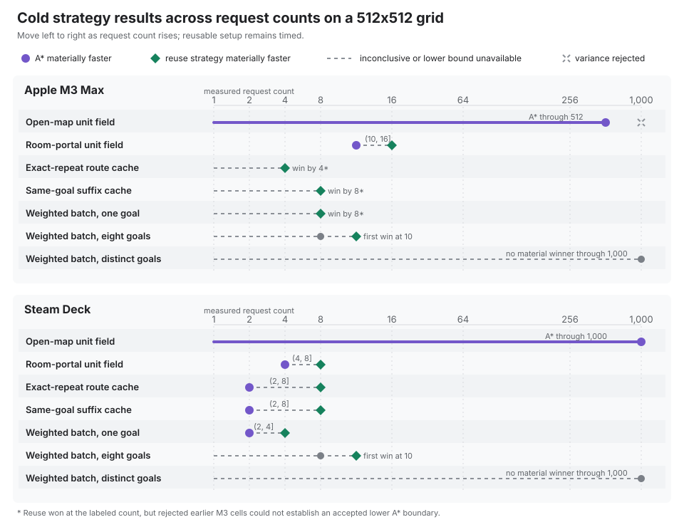

# A* vs route caches, batches, and distance fields

There is no universally fastest pathfinding API. The useful question is which
work repeats: a route, a goal, or nothing at all. tess exposes separate APIs
for those shapes so a caller can pay for reuse only when a measured workload
has reuse to exploit.

This comparison uses one 16x16 world and three requests. The
[complete self-checking example][strategy-main] compiles and runs in CI; each
excerpt below is copied from that source and rejected by CI if it drifts.
Timing evidence comes from the benchmark suite instead of from this teaching
program.

## The short answer

| Workload | Start with | What is reused |
| --- | --- | --- |
| One-off requests or mostly distinct goals | `astar_path` | Search scratch only |
| Exact or same-goal suffix routes repeat | `cached_astar_path` | Stored routes |
| Weighted requests arrive together | `weighted_path_batch` | Work within the batch |
| Many starts share one unit-cost goal | distance field | One reverse search tree |

Route caches, weighted batches, and the two-call distance-field API all support
dense and sparse-resident worlds. Persistent distance-field *products* are a
different, dense-only family. The
[pathfinding decision guide](guide/pathfinding.md) covers that residency
boundary and the full API selection tree.

## Where reuse crosses over

The campaign below measures logically cold strategy work with reusable storage
pre-reserved and the harness warmed once outside timing. Route-cache logical
state is cleared; cache population and distance-field construction stay inside
the timed operation. Every pair receives the same world and request array, and
untimed checks require matching status, endpoints, legal steps, and path cost.

The controlled campaign ran from commit `fcaa2165a8bd` on an Apple M3 Max and
an affinity-pinned Steam Deck. It found small, workload-specific crossovers,
not one agent-count rule:



| Question | M3 Max | Steam Deck |
| --- | --- | --- |
| Open map, shared unit goal | A\* won every accepted cell through 512 requests; 1,000 was rejected for variance | A\* still won at 1,000 requests |
| Room portals, shared unit goal | Field crossover `(10, 16]` | Field crossover `(4, 8]` |
| Exact-repeat route cache | Cache win observed by 4; lower boundary unresolved | Cache crossover `(2, 8]` |
| Same-goal suffix cache | Cache win observed by 8; lower boundary unresolved | Cache crossover `(2, 8]` |
| Weighted batch, one goal | Batch win observed by 8; lower boundary unresolved | Batch crossover `(2, 4]` |
| Weighted batch, eight goals | Accepted count 8 was inconclusive; first material win at 10 | Counts 1-8 were inconclusive; first material win at 10 |
| Weighted batch, all goals distinct | No material winner established through 1,000 | No material winner established through 1,000 |

A bracket `(a, b]` means the baseline materially won at `a` and reuse
materially won at `b`; it does not invent an unmeasured exact threshold. A
“win observed by” result has an accepted reuse win but no accepted lower
baseline boundary. Forty of 91 M3 cells exceeded the predeclared 5% variation
limit despite a clean rerun with a 100 ms sampling floor, so those cells remain
visible in the evidence but do not participate in the table. All 91 Steam Deck
cells passed at its affinity-pinned 10 ms floor.

| Question | Cold comparison | Decision signal |
| --- | --- | --- |
| Many starts share one goal | independent unit A* vs one field build plus reconstruction | First measured count where the field wins on that map |
| Exact requests repeat | independent unit A* vs a cleared route cache | First count that repays population and lookup cost |
| Starts lie on one goal route | independent unit A* vs a cleared suffix cache | First count that repays population and suffix lookup cost |
| Weighted requests arrive together | independent weighted A* vs one `weighted_path_batch` call | Whether grouping produces fields or A* fallbacks for the observed goal count |

The primary 512x512 sweep uses request counts 1, 2, 4, 8, 10, 16, 32, 64,
100, 128, 256, 512, and 1,000. After a bounded preflight established
headroom, the opt-in capacity sweep was extended to 131,072 requests and
grids through 16,384x16,384. Capacity cells identify the largest completed
rung under a declared time and memory budget; they do not deliberately drive
a machine into an out-of-memory failure.

The capacity sweep found different operational envelopes under a 20-second
per-process limit and conservative memory bounds:

| Axis | Apple M3 Max, 16 GiB watchdog | Steam Deck, 12 GiB address-space limit |
| --- | --- | --- |
| Grid, most strategies | Completed the 16,384x16,384 test ceiling | Completed 8,192x8,192; 16,384x16,384 reached the controlled resource/time boundary |
| Grid, one-goal weighted batch | Completed 8,192x8,192; 16,384x16,384 timed out | Same bracket |
| Grid, eight-goal weighted batch | Completed 4,096x4,096; 8,192x8,192 timed out | Same bracket |
| Requests, room-portal A\* | Completed 65,536; 131,072 timed out | Completed 16,384; 32,768 timed out |
| Requests, one/eight-goal weighted A\* | Completed 4,096; 8,192 timed out | One goal completed 4,096 and timed out at 8,192; eight goals timed out at the first 1,000-request capacity rung |
| Requests, reuse-heavy arms | Completed the 131,072 test ceiling | Completed the 131,072 test ceiling |

“Completed the ceiling” is intentionally not called a platform maximum. The
all-distinct request ladder is fixture-limited at 2,044 perimeter goals. At
131,072 requests, the one-goal weighted batch peaked near 6.0 GiB on M3 and
5.9 GiB on Deck, so the high-count results are throughput stress tests rather
than frame-budget recommendations.

Timing is accompanied by A* and unit-field expansions, reconstruction nodes,
field builds, A* fallbacks, cache hits, suffix hits, unique-goal counts,
retained cache entries and path nodes, and dense field-page bytes. Weighted
batches do not expose field expansions, so the comparison does not pretend
that every arm has a common expansion counter. The report distinguishes
requests from unique starts:
high request counts are a throughput stress, not a claim that every request
represents a distinct simulated agent. Field-product byte counts and warm
replay remain in the existing product benchmarks because the transient
two-call field and per-call batch API do not retain comparable products.

Map edits have a separate lifecycle question, so the crossover matrix does not
multiply every cell by invalidation policy:

| Retained work | Edit behavior | Evidence reported |
| --- | --- | --- |
| Exact route cache | Any world change clears the cache | Clears, misses, entries, and retained path nodes |
| Scoped-feasible route cache | Dense unit-cost worlds can preserve routes whose chunks did not change | Existing on-path and off-path edit benchmarks |
| Field product/cache | Product dependencies decide whether replay remains valid | Exact product and cache bytes plus warm replay timings |
| Transient field or batch | Nothing survives the call | No invalidation mode or invented retained-byte total |

Scoped-feasible reuse guarantees a legal route with truthful cost, not fresh
optimality: an unrelated edit that opens a shortcut can leave a previously
optimal route suboptimal. Sparse worlds retain whole-world sensitivity.

See the [campaign method and normalized evidence][crossover-evidence] before
using a bracket for a production decision.

## Algorithm and strategy status

The four choices in the short answer are not four peer algorithms. A* and the
reverse field builders perform graph search; caches, batches, and retained
products decide when to reuse that work; movement coordination resolves tile
conflicts after routes have been planned.

<div class="strategy-status-table" markdown="1">

| Layer | Capability | Status and boundary |
| --- | --- | --- |
| Search | Unit-cost A\* and weighted A\* | <span class="strategy-status strategy-status--released">Released</span> Exact, deterministic per-request routes over orthogonal, diagonal, and axial-hex movement models. |
| Search | Reverse BFS, reverse Dijkstra, and bounded-cost bucket search | <span class="strategy-status strategy-status--released">Released</span> Shared-goal distance labels: regular unit-cost models use BFS, weighted or non-unit models use Dijkstra, and small bounded integer costs can use an exact Dial-style queue. |
| Reuse | Exact/suffix route cache, weighted batch, and field-product cache | <span class="strategy-status strategy-status--released">Released</span> Workload policies layered over the searches above; they do not introduce another route-quality objective. |
| Topology | Reachability precheck, coarse region/portal routes, and chunk corridors | <span class="strategy-status strategy-status--released">Released</span> Coarse products can rule out known disconnection or guide exact segments; the automatic chunk-portal builder does not claim globally optimal portal selection. |
| Coordination | Joint movement and PIBT | <span class="strategy-status strategy-status--released">Released</span> Resolve contention between independently planned routes. They are movement algorithms, not globally optimal multi-agent pathfinding. |
| Future fields | Flow, congestion, and influence products | <span class="strategy-status strategy-status--designed">Designed, not shipped</span> The [roadmap](roadmap.md#future-and-deferred-extensions) keeps these explicit; today, callers can express congestion through a weighted cost field. |
| Application layer | Continuous steering, formations, and globally optimal multi-agent planning | <span class="strategy-status strategy-status--boundary">Out of scope</span> tess supplies the spatial substrate while applications retain these semantics. |

</div>

The [path architecture](architecture/path.md) specifies the search and reuse
contracts. The [simulation architecture](architecture/simulation.md) separates
route planning from joint movement and PIBT.

## See the call shapes

The embedded demo runs the same C++ model as the self-checking example. Its
animation shows call order and reuse; it deliberately does not time
WebAssembly or draw a search frontier that the APIs do not report.
The obstacle course is shared, and comparable requests return the same routes.
The cache card instead repeats its first request to expose reuse. Compare the
operation chain and data-product label above each map to see whether tess
repeats searches, retains a route, groups a batch, or labels the reachable map
for later reads.

<iframe class="strategy-demo-frame"
        src="../demo/strategies/"
        loading="lazy"
        title="Interactive pathfinding strategy comparison"></iframe>

[Open the strategy demo in a separate page](../demo/strategies/).

## One world, one request set

The example uses three solid vertical walls with alternating single-tile gaps.
Every passable tile has unit cost, so each strategy must solve the
same visible obstacle course and the returned costs remain comparable. The
demo model copies each borrowed path before the next scratch mutation so the
browser reads read-only C++ result snapshots.

<!-- tess-snippet: strategy-world source=examples/pathfinding_strategies_model.cc -->
```cpp
struct PassableTag {};
struct CostTag {};
using WeightedMovement =
    tess::movement::PositiveCostFieldMovement<PassableTag, CostTag>;

using Shape = tess::Shape<tess::Extent3{16, 16}, tess::Extent3{8, 8}>;
using Schema = tess::FieldSchema<tess::Field<PassableTag, std::uint8_t>,
                                 tess::Field<CostTag, std::uint32_t>>;
using World = tess::AlwaysResidentWorld<Shape, Schema>;
```
<!-- /tess-snippet -->

<!-- tess-snippet: strategy-obstacles source=examples/pathfinding_strategies_model.cc -->
```cpp
[[nodiscard]] constexpr auto demo_tile_passable(std::int64_t x, std::int64_t y)
    -> bool {
  if (x == 4) {
    return y == 4;
  }
  if (x == 8) {
    return y == 11;
  }
  if (x == 12) {
    return y == 6;
  }
  return true;
}
```
<!-- /tess-snippet -->

<!-- tess-snippet: strategy-requests source=examples/pathfinding_strategies_model.cc -->
```cpp
constexpr auto kGoal = tess::Coord2{15, 15};

constexpr auto kRequests = std::array{
    tess::PathRequest{tess::Coord2{0, 0}, kGoal},
    tess::PathRequest{tess::Coord2{0, 1}, kGoal},
    tess::PathRequest{tess::Coord2{0, 2}, kGoal},
};
```
<!-- /tess-snippet -->

## Independent A*: the default

Plain A* is the baseline when requests do not share useful work. The example
runs all three requests independently and reuses only scratch storage; it does
not reuse search results. Do not introduce a cache or field until measurements
show repeated structure.

<!-- tess-snippet: strategy-astar source=examples/pathfinding_strategies_model.cc -->
```cpp
tess::PathScratch scratch;
for (std::size_t index = 0; index < kRequests.size(); ++index) {
  const auto result =
      tess::astar_path<World, PassableTag>(world, kRequests[index], scratch);
  snapshot.requests[index] = copy_result(result);
}
```
<!-- /tess-snippet -->

Use it when goals are mostly distinct, the map changes too often for retained
routes to survive, or the request count is small enough that the direct call is
already below the application budget.

## Route cache: repeated paths on an unchanged map

`cached_astar_path` stores exact routes and same-goal suffixes. A first request
still performs A*; a repeat can return without expanding search nodes.

<!-- tess-snippet: strategy-cache source=examples/pathfinding_strategies_model.cc -->
```cpp
tess::PathScratch scratch;
tess::UnitRouteCache cache;
const auto first = tess::cached_astar_path<World, PassableTag>(
    world, kRequests.front(), scratch, cache);
snapshot.requests[0] = copy_result(first);
const auto repeated = tess::cached_astar_path<World, PassableTag>(
    world, kRequests.front(), scratch, cache);
snapshot.requests[1] = copy_result(repeated);
```
<!-- /tess-snippet -->

The cache is caller-owned and bounded. Its world fingerprint invalidates stale
entries in exact mode; scoped feasibility is a deliberate alternative with a
different optimality contract. Read the
[route-cache specification](architecture/path.md) before choosing that policy.

## Weighted batch: group work arriving together

`weighted_path_batch` groups requests by goal. Repeated goals can share a
bounded weighted field; distinct goals fall back to per-request weighted A*.
The API therefore preserves one result per input request while choosing the
strategy inside the batch.

<!-- tess-snippet: strategy-batch source=examples/pathfinding_strategies_model.cc -->
```cpp
tess::WeightedPathBatchScratch scratch;
const auto results =
    tess::weighted_path_batch<World, WeightedMovement, /*MaxCost=*/32>(
        world, kRequests, scratch);
for (std::size_t index = 0; index < results.size(); ++index) {
  snapshot.requests[index] = copy_result(results[index]);
}
```
<!-- /tess-snippet -->

Use the statistics (`field_builds`, `astar_fallbacks`, and `unique_goals`) to
verify that a real request set contains the reuse the batch was meant to find.

## Distance field: many starts, one goal

A reverse distance field builds one goal-rooted search tree. Every matching
start then reconstructs a path from that field instead of running another A*.

<!-- tess-snippet: strategy-distance-field source=examples/pathfinding_strategies_model.cc -->
```cpp
tess::DistanceFieldScratch scratch;
const auto field =
    tess::build_distance_field<World, PassableTag>(world, kGoal, scratch);
for (std::size_t index = 0; index < kRequests.size(); ++index) {
  const auto result = tess::distance_field_path<World, PassableTag>(
      world, kRequests[index], scratch);
  snapshot.requests[index] = copy_result(result);
}
```
<!-- /tess-snippet -->

The field is tied to its goal and world snapshot. Rebuild it after relevant
world or residency changes. For cross-frame, multi-goal retention on a dense
world, use the separate `DistanceFieldProduct` and `FieldProductCache` family.

Run the controlled comparison on a target machine with an environment metadata
file and a memory limit appropriate to that host:

```sh
cmake --preset bench
cmake --build --preset bench --target tess_bench_path_strategy_crossover
python3 tools/path_strategy_campaign.py primary \
  --binary build/bench/bench/tess_bench_path_strategy_crossover \
  --source bench/tess_path_strategy_crossover_bench.cc \
  --environment environment.json \
  --output path-strategy-results.json \
  --memory-limit-gib 12
```

The driver interleaves paired arms in fresh processes, checkpoints each cell,
and rejects an unstable cell from crossover calculation. Its separate
`capacity` mode runs ascending grid and request ladders with per-process time
and address-space limits, then stops a ladder at its first incomplete rung.
The decision remains workload-specific: inspect both timing and counters, and
retain the simpler API when the measured benefit does not justify another
invalidation or grouping lifecycle.

<details class="strategy-alternatives" markdown="1">
<summary>Why some alternatives were not promoted</summary>

These decisions are deliberately scoped. A rejected browser policy or
internal data structure is not a rejection of the broader research idea.

- **Four-ary open-list heap** —
  <span class="strategy-status strategy-status--rejected">Experiment rejected</span>
  It helped a few A* benchmark cases but substantially regressed weighted
  field builds and failed the second-platform non-regression gate
  ([evidence][quad-heap-rejection]).
- **Dynamic congestion prices in the colony demo** —
  <span class="strategy-status strategy-status--released">Validated caller recipe</span>
  The original policies produced incomplete arrivals and were rejected
  ([evidence][congestion-rejection]); a later revalidation on the corrected
  topology superseded that result. The bounded caller policy is documented
  with its measured boundary in [spatial coordination][spatial-coordination]
  and the [retained evidence][congestion-revalidation].
- **Balanced gate waypoints** —
  <span class="strategy-status strategy-status--rejected">Experiment rejected</span>
  Equal cohorts synchronized agents onto capacity hotspots and lost arrivals
  ([evidence][waypoint-rejection]).
- **Eight-step WHCA-style space-time planning** —
  <span class="strategy-status strategy-status--boundary">Not promoted</span>
  The screen cost 30–90x the cheap resolver per tick and degraded at dense
  bottlenecks beyond its horizon ([screening study][movement-screening]).

The pre-RC screens in the [execution plan][execution-plan] rejected all three
remaining classical candidates: gated 4-connected JPS on dense rubble maps
([evidence][jps-rejection]), whole-query bidirectional A* on five of eight
cells ([evidence][bidir-rejection]), and goal-keyed D* Lite at feasibility
([evidence][dstar-rejection]). Each record has a scoped reconsideration
condition; none is a verdict on other domains. Theta\* remains deferred until
its supporting contracts exist.

</details>

[strategy-main]: https://github.com/kindjie/tess/blob/main/examples/pathfinding_strategies.cc
[benchmark-source]: https://github.com/kindjie/tess/tree/main/bench
[crossover-evidence]: https://github.com/kindjie/tess/tree/main/docs/planning/evidence/v1.0/path-strategy-crossover
[quad-heap-rejection]: https://github.com/kindjie/tess/blob/main/docs/planning/optimization-log-archive-2026-08-14.md
[congestion-rejection]: https://github.com/kindjie/tess/blob/main/docs/planning/optimization-log-archive-2026-08-17.md
[congestion-revalidation]: https://github.com/kindjie/tess/blob/main/docs/planning/evidence/v1.0/c5-congestion/README.md
[jps-rejection]: https://github.com/kindjie/tess/blob/main/docs/planning/evidence/v1.0/p3-jps/README.md
[bidir-rejection]: https://github.com/kindjie/tess/blob/main/docs/planning/evidence/v1.0/p4-bidir/README.md
[dstar-rejection]: https://github.com/kindjie/tess/blob/main/docs/planning/evidence/v1.0/p5-dstar/README.md
[waypoint-rejection]: https://github.com/kindjie/tess/blob/main/docs/planning/optimization-log-archive-2026-08-17.md
[movement-screening]: https://github.com/kindjie/tess/blob/main/docs/planning/local-movement-resolution.md#evidence
[execution-plan]: https://github.com/kindjie/tess/blob/main/docs/planning/v0.13-to-v1.0-execution-plan.md
[spatial-coordination]: architecture/spatial-coordination.md
