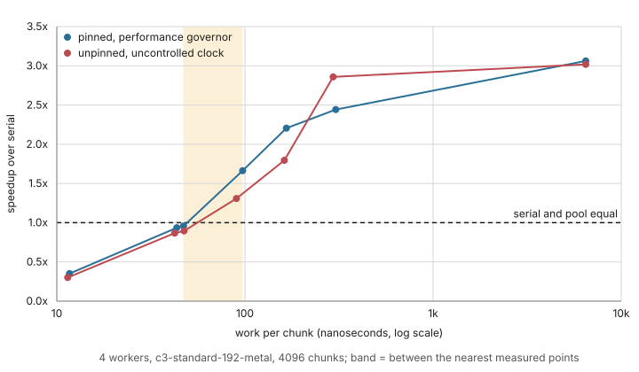
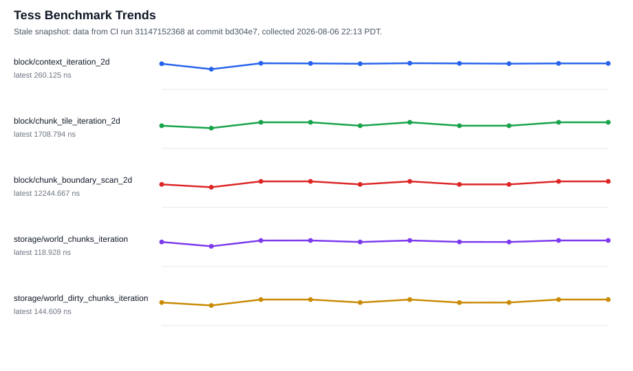

# Performance

tess is performance-first: every benchmark suite is gated in CI with
calibrated per-benchmark ceilings, so the numbers below are enforced, not
aspirational.

Representative medians from the benchmark suite on an Apple M3 Max
(single-threaded):

- A* across an open 512x512 grid, corner to corner (a 1,022-step path,
  ~1,023 nodes expanded): ~2.1 us; the weighted variant: ~2.4 us.
- One clean tick of 100 path agents with retained routes: ~330 ns.
- One `weighted_path_batch` plan of 100 near-goal requests on a 512x512
  grid: ~50 us.

Memory, not time, but enforced the same way: `examples/sparse_stream.cc`
self-checks a 1,024-chunk world held to a 16-page residency budget — 64x
less resident field storage than the dense equivalent (1 MiB vs 16 KiB
of page data; residency metadata is budgeted separately).

## When the worker pool is worth it

The parallel phase executor is not free: dispatching a phase costs about
the same as a chunk of trivial work. Whether the pool beats the serial
executor is decided almost entirely by **how much work each chunk does**,
not by how many chunks there are.

At four or more workers, on the machine below:

- **Above roughly 95 ns of work per chunk the pool wins**, and keeps
  winning as the work grows — reaching 3.1x at four workers for a
  compute-bound chunk.
- **Below roughly 45 ns per chunk the pool loses**, and the lighter the
  work the worse it gets: a one-tile-per-chunk phase runs about 3x
  *slower* through the pool than serially.
- **Between those two figures the answer depends on your workload.**

A practical starting point: use about 100 ns of per-chunk work as the
threshold, then measure on your own hardware. You can read your own
figure straight off a serial run — total phase time divided by chunk
count.

Both campaigns plotted above agree on this bracket despite differing in
thread pinning and CPU frequency control, which is why it is stated as a
range rather than a single number.

**Scope.** Measured on a `c3-standard-192-metal` (2x48 core Xeon 8481C)
over a 4096-chunk world, 20 repetitions per point, speedup against
`SerialPhaseExecutor` at the same world size. Two-worker results are
withheld: they carry an unexplained anomaly under pinning. Beyond one
socket the measurements are too noisy to publish at all — see
[the optimization log](planning/optimization-log.md) for the full
campaign record, including what these numbers do not show.

## Trend snapshot

Data from CI run 29211536546, collected 2026-07-12 16:09 PDT; the snapshot
may be stale by a few commits.

| Benchmark | Latest median CPU ns |
| --- | ---: |
| `block/context_iteration_2d` | 277.272 |
| `block/chunk_tile_iteration_2d` | 1484.974 |
| `block/chunk_boundary_scan_2d` | 11004.955 |
| `storage/world_chunks_iteration` | 165.552 |
| `storage/world_dirty_chunks_iteration` | 199.969 |

CI collects baseline artifacts on every main run; these medians come from
those artifacts. Individual optimization experiments, rejected ideas, and
deferred performance work are recorded in the
[optimization log][optimization-log]; threshold calibration methodology is
recorded in the [calibration history][calibration]. The regeneration
workflow for this page lives in [`CONTRIBUTING.md`][contributing].

[optimization-log]: https://github.com/kindjie/tess/blob/main/docs/planning/optimization-log.md
[calibration]: https://github.com/kindjie/tess/blob/main/docs/planning/benchmark-calibration.md
[contributing]: https://github.com/kindjie/tess/blob/main/CONTRIBUTING.md
